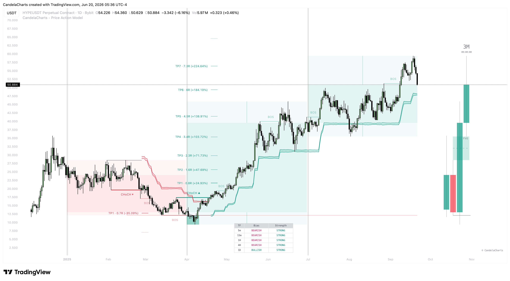

# Framework

The Price Action Model is designed to provide a structured, mechanical approach to trading by leveraging high-probability setups. This section will guide you through exactly how the indicator works and the step-by-step process to frame and execute your trades.

<figure><figcaption></figcaption></figure>

### How the Indicator Works

The indicator uses a strict sequence of events to validate a setup:

1. **Pivots & Market Structure:** It continuously calculates pivot highs and lows over a specific lookback period to establish the current market structure.
2. **Liquidity Pools:** Each significant pivot high or low represents a pool of liquidity. The indicator tracks these levels.
3. **The Sweep:** It waits for the price to breach one of these liquidity pools, capturing a stop-run or "sweep."
4. **The Shift (CHoCH):** After a sweep, the indicator waits for a Change of Character in the opposite direction. If a buy-side sweep occurs, it looks for a bearish CHoCH. If a sell-side sweep occurs, it looks for a bullish CHoCH.
5. **Model Confirmation:** Once the CHoCH is confirmed, the model is officially formed. The indicator then projects dynamic take-profit targets and initiates an ATR-based trailing stop.

### Step-by-Step Usage

#### 1. Establish Context & Bias

Before looking for an entry, you must understand the broader market context.

* **Use the MTF Dashboard:** Check the dashboard to ensure your higher timeframes (e.g., 1H, 4H, 1D) are aligned in the direction of your intended trade.
* **HTF Confluence:** Look for setups that form around Higher Timeframe Fair Value Gaps (FVGs) or significant HTF support/resistance levels.

#### 2. Wait for the Liquidity Grab (S-Area)

Patience is key. The indicator filters out low-probability trades by requiring a liquidity grab first.

* **Bullish Setup:** Wait for price to drop below a previous pivot low, grabbing sell-side liquidity. The indicator will highlight this sweep area (S-Area).
* **Bearish Setup:** Wait for price to rise above a previous pivot high, grabbing buy-side liquidity.

#### 3. Identify the Change of Character (CHoCH)

The sweep alone is not an entry signal; it is just the setup. You need confirmation that the trend is reversing.

* After the liquidity grab, watch for a **CHoCH**. The indicator will automatically draw the CHoCH line and label it when the market structure shifts in the intended direction.
* This is your confirmation to enter the trade.

#### 4. Execution & Risk Management

Once the model is confirmed, it's time to execute.

* **Entry:** You can enter at market immediately after the CHoCH confirmation, or look for a pullback into a lower timeframe FVG or Order Block within the new leg.
* **Stop Loss:** Initial stop loss should be placed safely below the low of the sweep (for bullish) or above the high of the sweep (for bearish).
* **Trailing Stop:** Once the trade moves in your favor, utilize the indicator's dynamic ATR Trailing Stop band to manage risk. Move your stop loss along the band as price trends.

#### 5. Take Profit Targets

The indicator generates automated TP levels based on market volatility (ATR).

* Scale out of your position as price hits each dynamic Take Profit target.
* Allow a small runner to remain open, managed entirely by the trailing stop, to capture outsized trend continuations.

### Best Practices

* **Don't force trades:** Only enter when the 15m and 1H agree with the 4H direction. If they don’t align, sit on your hands.
* **Avoid Choppiness:** In ranging markets, liquidity grabs can happen frequently without leading to a sustained trend. Always filter trades through the HTF Dashboard.
