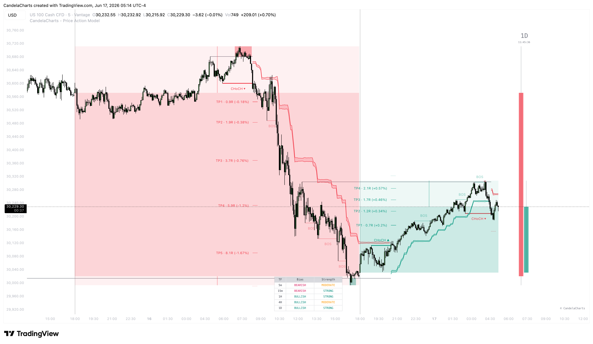
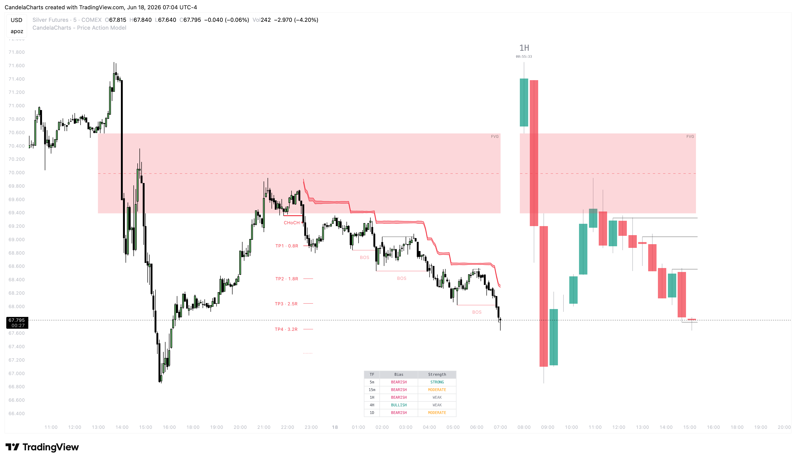

# Timeframes

Multi-Timeframe (MTF) analysis is the backbone of consistent trading. A lower timeframe setup is significantly more likely to succeed if it aligns with the higher timeframe narrative. The Price Action Model offers several powerful tools to integrate MTF data directly into your current chart.

### The Model Timeframe

By default, the indicator calculates its market structure, sweeps, and targets based on the timeframe of the chart you are currently viewing. However, you can use the **Model Timeframe** setting to decouple this.

* For example, you can sit on a 1m chart to watch micro price action, while forcing the indicator to calculate and draw its setups based on 15m data. This ensures you are trading 15m setups while using the 1m for ultra-precise entries.

### HTF Candle Overlays (Ghost Candles)

<figure><figcaption></figcaption></figure>

Switching back and forth between timeframes can disrupt your flow and cause you to lose context. The indicator solves this by overlaying up to two Higher Timeframe (HTF) candles over your current chart.

* **Visual Context:** You can view a faded 4H and Daily candle forming dynamically in the background while trading on a 5m chart.
* **Mapping Options:** You can map these HTF candles perfectly to your lower timeframe, giving you a precise understanding of how the LTF price action is carving out the wicks and bodies of the macro candles.

### HTF Fair Value Gaps (FVGs)

<figure><figcaption></figcaption></figure>

Fair Value Gaps on higher timeframes act as powerful magnets and reaction zones.

* The indicator automatically detects unmitigated FVGs from your specified higher timeframes and draws them on your chart.
* **LTF Mapping:** When enabled, the indicator will map these HTF gaps directly onto your LTF chart. This means you don't have to guess if a 15m candle has tapped into a 4H FVG; the zone is drawn exactly where it belongs, providing massive confluence for your entries.
