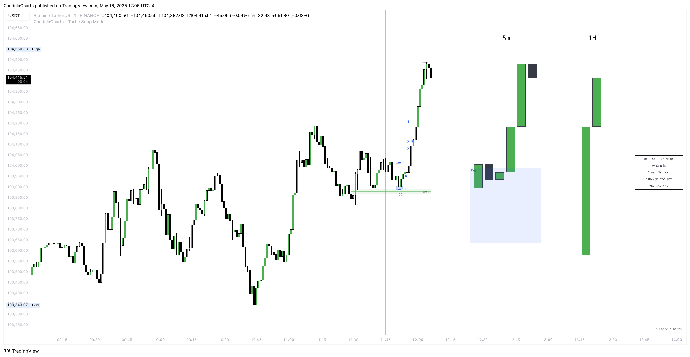

# Turtle Soup Model™

The ICT Turtle Soup Model is a reversal-based trading strategy developed by Michael J. Huddleston, known in the trading community as the Inner Circle Trader (ICT). Rooted in the concept of stop-hunting and liquidity manipulation, this strategy seeks to exploit failed breakouts at previous swing highs or lows.&#x20;

Unlike traditional breakout systems that assume continuation, the Turtle Soup setup anticipates a sharp reversal after the market takes out a widely recognized level—such as a prior high or low—and then fails to hold beyond it.

<figure><figcaption></figcaption></figure>

This pattern is often a sign that large institutions, or "smart money," have engineered a liquidity run to trigger retail stop orders and enter positions at more favorable prices.&#x20;

The ICT version enhances the original Turtle Soup concept by incorporating market timing elements, such as specific trading sessions (e.g., London or New York), time-of-day sensitivity, and higher timeframe context.


This model does not provide Buy/Sell signals.

