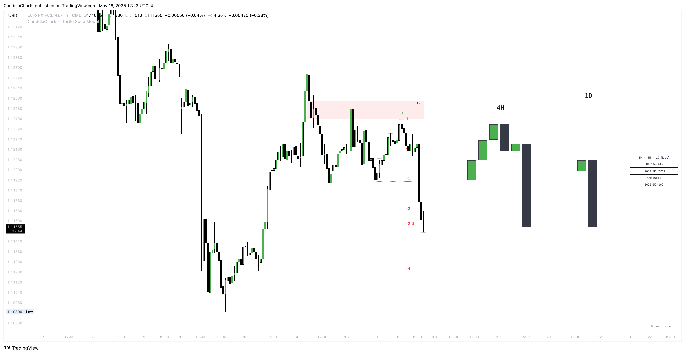

# Dashboard

The Turtle Soup Model Dashboard provides traders with essential, real-time information to support decision-making and enhance market analysis.&#x20;

<figure><figcaption></figcaption></figure>

Designed to present key data points, the dashboard offers a comprehensive overview of current market conditions and the chart’s state, allowing traders to make informed and timely decisions.

### **Bias**

This section indicates the overall market bias based on the current model and timeframe. It helps traders quickly assess whether the market is trending bullish, bearish, or neutral, offering a clear directional view. Understanding the market bias enables traders to align their strategy with prevailing market conditions.

### **Current Model**

The dashboard highlights the current model identified by the Turtle Soup Model, such as a Sweep or Market Structure Shift (MSS). This feature lets traders instantly know which market structure is active, helping them understand the underlying market dynamics and identify potential opportunities for trade.

### **Remaining Time Until HTF Candle Close**

This section displays a countdown showing the time remaining until the higher timeframe (HTF) candle closes. It provides traders with valuable insights into how much time is left for the current candle to complete, assisting with the timing of entries, exits, or model validations. This feature is especially useful for traders focused on higher timeframes who need to make decisions based on the closure of key candles.

### **Sessions Filter**

This filter allows users to view trading data within specific market sessions (Killzones), helping traders focus on the most relevant data for their trading hours.

### **Model Status Filter**

This filter enables users to focus on specific states or conditions of the Turtle Soup Model, streamlining the analysis of key trading patterns and ensuring the dashboard highlights only the most pertinent information.

### **Asset and Date**

This section provides details on the asset currently being analyzed and the date of the chart. It ensures that traders are working with up-to-date market information, relevant to their analysis and trade planning.

The Turtle Soup Model Dashboard consolidates critical information, including market bias, the current model, and the remaining time until the HTF candle closes. By presenting these data points in a clear, streamlined format, traders can make more informed decisions and better navigate market conditions with confidence and precision. The added filters and time-sensitive features further enhance the dashboard's utility, ensuring that traders are equipped to act quickly and effectively in a dynamic market environment.
