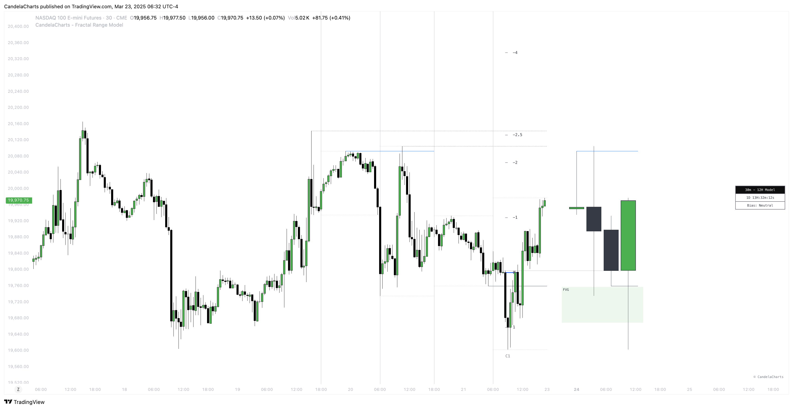
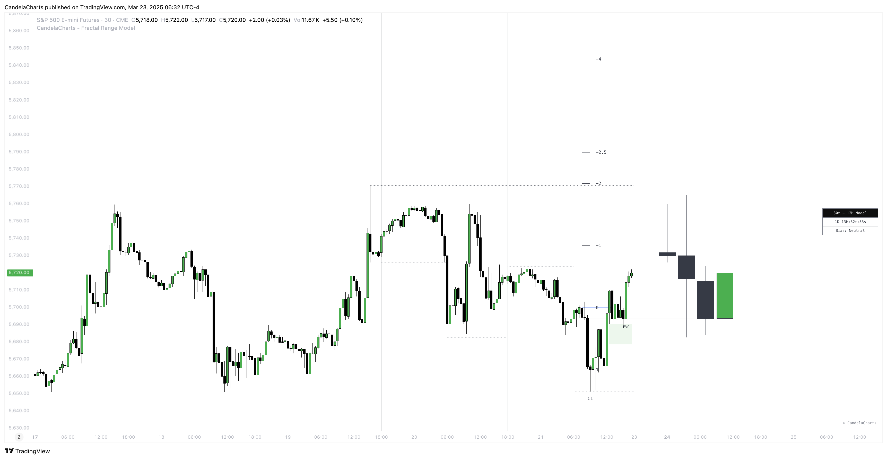

# PD Arrays

The Fractal Range Model (FRM) provides two distinct sets of **PD Arrays**: one for **Higher Time Frames (HTF)** and one for **Lower Time Frames (LTF)**.

These arrays, referred to as:

* **FVG** (Fair Value Gap)
* **IFVG** (Inverse Fair Value Gap)

play a critical role in market analysis and trading strategy.

### HTF PD Arrays

The **HTF PD Arrays** are key points of interest that indicate significant market levels where sweeps (sharp price movements) are likely to occur.

<figure><figcaption></figcaption></figure>

These arrays represent areas of high potential for reversals when touched by a price sweep. When a sweep forms and touches an HTF PD Array, it signals a strong probability of price reversal.

Traders can use these levels as potential exit points or as areas to look for price reaction, making them crucial for identifying important turning points in the market.

### LTF PD Arrays

The **LTF PD Arrays**, on the other hand, are used for identifying **entry points**. When a model, such as a **Sweep** or **CISD (Change In Structure Direction)**, forms on the chart, the Fractal Range Model highlights the **PD Arrays** around the newly formed model.

<figure><figcaption></figcaption></figure>

These PD Arrays serve as key reference points for traders to enter positions. By recognizing the array's location relative to the newly formed market structure, traders can make informed decisions about entering trades, whether in the direction of the trend or anticipating a potential reversal.

### Key Points

* **HTF PD Arrays** (FVG/IFVG) act as **resistance** or **support** levels, offering areas of potential reversal when touched by a market sweep. These are crucial for identifying significant price levels that may indicate a reversal or retracement.
* **LTF PD Arrays** provide **entry points** into the market. As a model like a Sweep or CISD is formed, the Fractal Range Model identifies nearby PD Arrays, giving traders specific levels to watch for optimal trade entries.

By using both **HTF PD Arrays** for potential reversals and **LTF PD Arrays** for entries, the Fractal Range Model equips traders with a comprehensive framework for both market analysis and actionable trade decisions.

These arrays help to pinpoint significant levels and inform key decisions for timing entries more effectively.
