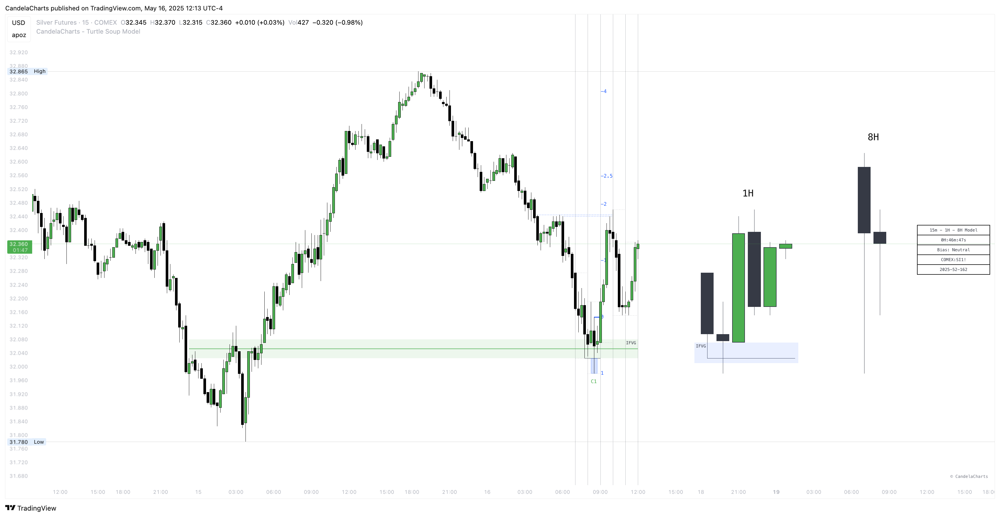

# Standard Deviation

Once a model is formed, the Turtle Soup Model automatically generates standard deviation levels based exclusively on the wicks of the MSS High and MSS Low.&#x20;

<figure><figcaption></figcaption></figure>

By anchoring standard deviation to the wicks, the Turtle Soup Model captures the full range of price fluctuations, incorporating potential volatility and broader market movements.&#x20;

This approach provides traders with a more comprehensive understanding of the market’s potential behavior, highlighting areas where price could realistically move in the near term.

Whether for planning exits, managing risk, or evaluating price trends, these wick-based standard deviations are a core feature of the Turtle Soup Model, providing valuable insights into future price movements and assisting traders in executing strategies with greater confidence.
