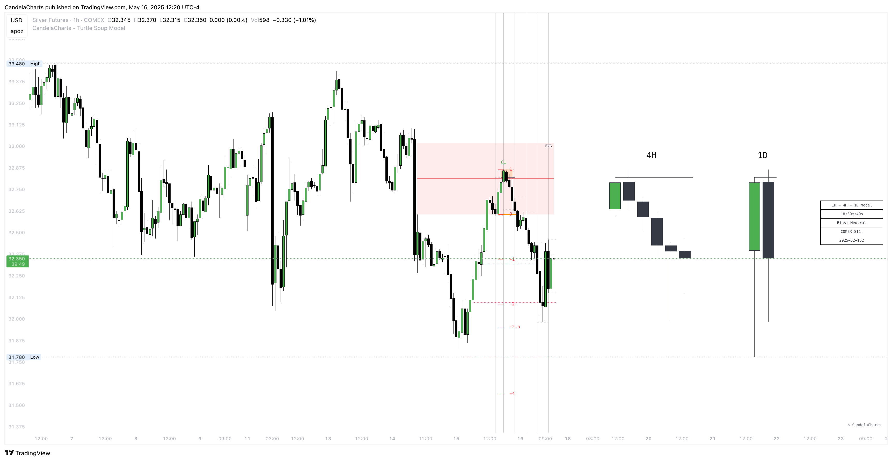

# Filters

The **Turtle Soup Model** allows traders to filter potential setups by specific **Killzones**, such as Asia, London, NY AM, NY Launch, and NY Open.&#x20;

<figure><figcaption></figcaption></figure>

These Killzones correspond to key periods of market activity, where liquidity and volatility are typically more pronounced, giving traders an advantage in identifying high-probability setups.

<table><thead><tr><th width="224.4140625"></th><th></th></tr></thead><tbody><tr><td>Asia (20:00 - 00:00)</td><td>Marks the start of the trading day with moderate volatility. Often sets up liquidity levels that later sessions may target.</td></tr><tr><td>London (02:00 - 05:00)</td><td>High-volume session as major European markets open. Often establishes the day’s directional bias with strong institutional activity.</td></tr><tr><td>NY AM (09:30 - 11:00)</td><td>U.S. equity market open. A key window for volatility spikes and liquidity grabs, making it ideal for Turtle Soup reversals.</td></tr><tr><td>NY Launch (12:00 - 13:00)</td><td>Midday session where markets often pause or reverse. Useful for identifying continuation or reversal patterns.</td></tr><tr><td>NY PM (13:30 - 16:00)</td><td>Final hours of the U.S. session. Often sees profit-taking and closing moves, creating opportunities for late-day setups.</td></tr></tbody></table>

Additionally, the model provides the flexibility to filter by **customer-defined hours ranges**, allowing users to tailor the analysis to their preferred trading times or specific market conditions.&#x20;

This feature enhances the model’s adaptability, ensuring that traders can focus on the timeframes that align with their strategy and trading objectives, improving the overall effectiveness of their trades.
