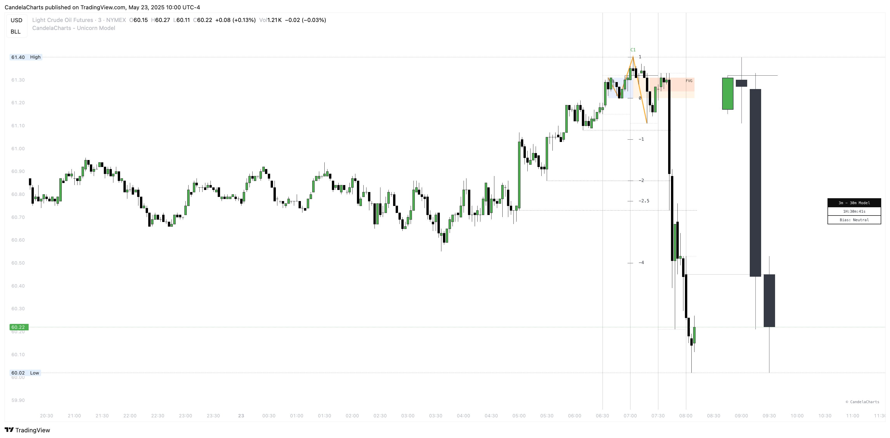

# Unicorn Model™

The **Inner Circle Trader (ICT)** methodology, developed by Michael J. Huddleston, centers around the concept of "Smart Money" — the actions of institutional traders who drive the market.

Among ICT's vast library of trading concepts, the **Unicorn Model** stands out as a specific intraday or short-term trade setup designed to capture high-probability moves during key times of the trading day.

<figure><figcaption></figcaption></figure>

Explore the **structure, components, logic, and application** of the ICT Unicorn Model, offering a roadmap for traders looking to implement it within a broader smart money framework.


* This model is designed for educational and analytical purposes to study market structure, trends, and price behavior.
* It does not provide trading signals and should not be used as a substitute for independent analysis or proper risk management.
* The model is timeframe - and symbol-agnostic, automatically adapting to any market, asset, or chart it is applied to.

