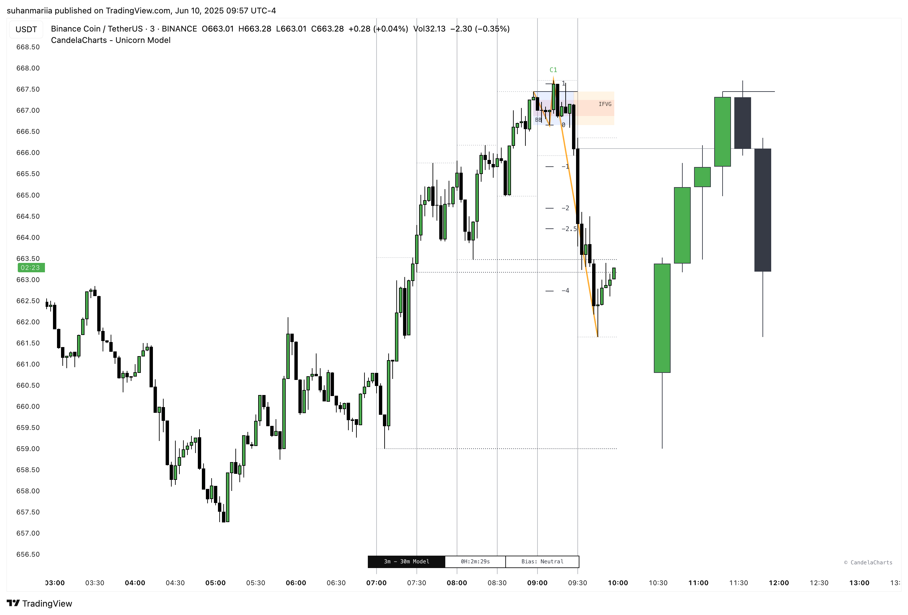

# Components

The **ICT Unicorn Model** is an intraday liquidity-based setup taught by the Inner Circle Trader (ICT). It aims to capitalize on engineered liquidity grabs and sharp market structure shifts during key trading sessions, particularly the **London** and **New York killzones**. This model targets the moment when smart money takes out obvious highs or lows (liquidity pools) and then quickly reverses direction, signaling a shift in institutional order flow.

<figure><figcaption></figcaption></figure>

Below are the key components that make up the algorithm:

* **Sweep**
* **D-purge**
* **Zigzag (Breaker)**
* **PD Arrays (FVG, IFVG)**
* **Macros**
* **Projections**
* **Liquidity**

## **Components**

### **1. Sweep**

**Definition:** A **Sweep** is a price action event where the current candle’s wick temporarily breaches the high or low of the previous candle, but the body closes back **within** the range of that prior candle.

**Formation:**

* **Bullish Sweep:** Price temporarily exceeds the high of the preceding candle before closing back within its range.
* **Bearish Sweep:** Price temporarily breaches the prior candle’s low before closing back inside its range.

**Invalidation:**

* **Bullish Sweep:**
  * Invalidation occurs if the subsequent bullish candle closes above the high of the previous candle.
  * Invalidation occurs if any bullish candle that follows closes above the high of the prior candle.
* **Bearish Sweep:**
  * Invalidated if the next candle is bearish and closes with its body below the previous candle’s low.
  * The setup is invalidated if any following bearish candle closes below the prior candle’s low.


In real-time models, the sweep is removed as soon as the model is invalidated and the candle closes. In contrast, other models retain the sweep until it is explicitly invalidated, with any updates clearly reflected in the user interface.


### **2. D-Purge**

**Definition:** A D-purge is a type of Sweep where the price exceeds both the high and low of the previous candle (via wicks) and then closes within the range of the prior candle.

**Formation:** A D-purge Sweep requires two higher-time-frame candles, with both sides of the previous candle being swept. The side that is swept last determines the direction of the D-purge.

**Invalidation:**

* **Bullish D-purge:**
  * Invalidated if the next candle is bullish and closes its body above the high of the prior candle.
  * Invalidated if any subsequent bullish candle closes above the high of the previous candle.
* **Bearish D-purge:**
  * Invalidated if the next candle is bearish and closes its body below the low of the prior candle.
  * Invalidated if any subsequent bearish candle closes below the low of the prior candle.

### **3. Zigzag (Breaker)**

**Definition:** A Zigzag (Breaker Block) is a price pattern where a market reverses from a lower low (or higher high), forms a new swing high (or low), and then pulls back into the breaker block (origin of the move) to continue in the new direction.

**Formation:**

* **Bullish Zigzag:** Price makes a lower low, then breaks structure with a higher high and pulls back into the breaker block/FVG zone for a continuation upward.
* **Bearish Zigzag:** Price makes a higher high, then breaks structure with a lower low and pulls back into the breaker block/FVG zone for a continuation downward.

**Invalidation:**

* **Bullish Zigzag:** The setup fails if price closes below the lower low, invalidating the breaker block support.
* **Bearish Zigzag:** The setup fails if price closes above the higher high, invalidating the breaker block resistance.

### **4. PD Arrays (FVG, IFVG)**

**Definition:** PD Arrays are models that describe how price is likely to be delivered from one liquidity point to another, based on smart money behavior.&#x20;

Model supports following PD Arrays for HTF and LTF:

* **Fair Value Gaps (FVGs):** Imbalances between buying and selling, often acts as a **magnet for price** or a **support/resistance zone**
* **Inversion Fair Value Gaps:** Former FVGs that, once filled or mitigated, reverse roles — acting as support/resistance or continuation zones.

**Formation:**&#x20;

#### Fair Value Gaps (FVG)

FVGs represent imbalances caused by aggressive buying or selling, leaving an unfilled price zone between **Candle 1** and **Candle 3**.

* **Bullish FVG:** Forms after a strong up move; gap exists between Candle 1's high and Candle 3's low.
* **Bearish FVG:** Forms after a strong down move; gap exists between Candle 1's low and Candle 3's high.

#### Inversion Fair Value Gaps (FVG)

Once an FVG is filled, it may invert roles.

* **Bullish Inversion FVG:** Former bearish FVG now acts as support.
* **Bearish Inversion FVG:** Former bullish FVG now acts as resistance.

**Invalidation:**

**Fair Value Gaps (FVG):** An FVG is invalidated if price fully trades through it and closes inside the gap, breaking the imbalance’s influence.

**Inversion Fair Value Gaps (IFVG):** IFVG is invalidated when price breaks through and closes beyond it in the opposite direction.

### **5. Macros**

**Definition:** In the Unicorn Model, ICT Macro Times are high-probability time windows—like London and New York opens—when the market algorithm targets liquidity and reprices imbalances. These sessions align with institutional activity and are used to anticipate major price moves using PD arrays and liquidity zones.

**Formation:** Macro Times often produce FVGs, liquidity sweeps, and displacement during session opens or closes. The Unicorn Model looks for confluence between this time-based volatility and structural elements like breaker blocks or inversion FVGs to frame high-probability trade setups.

**Invalidation:** An ICT Macro Time setup in the Unicorn Model is invalidated if price fails to form FVGs, lacks liquidity sweeps, or breaks key levels without confirmation during the expected time window. When this occurs, the model advises standing down or waiting for the next macro session.

### **6. Standard Deviations**

**Definition:** Standard Deviations measure the expected extension of price based on its dispersion from a key structural move, helping forecast potential swing targets and overextensions.

**Formation:** Standard Deviations are calculated from the Zigzag 2nd Point (anchor) to the Zigzag 3rd Point (manipulation swing). This range forms the projection base, from which levels like 1σ, 2σ (standard deviations) are extended to anticipate price expansion.

**Invalidation:** A Standard Deviation is invalidated when price **reaches or exceeds the 2σ level**, signaling the move may be overextended or complete.

### **7. Liquidity**

**Definition:** Liquidity represents price zones where Smart Money targets resting orders—typically around highs, lows, and institutional levels—to engineer reversals or continuations.

**Formation:** Liquidity zones form at key structural points such as Zigzag pivots, PDH/PDL, PWH/PWL, and internal range extremes—often aligning with PD Arrays like FVGs or Breakers.

**Invalidation:** A liquidity zone is considered invalidated once price cleanly trades through it, indicating the liquidity has been consumed or no longer holds significance.
