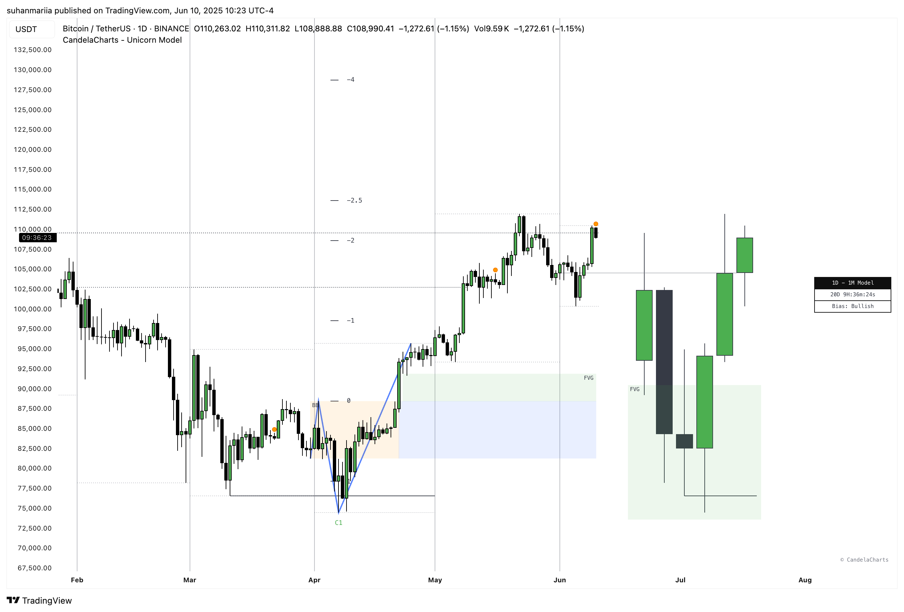
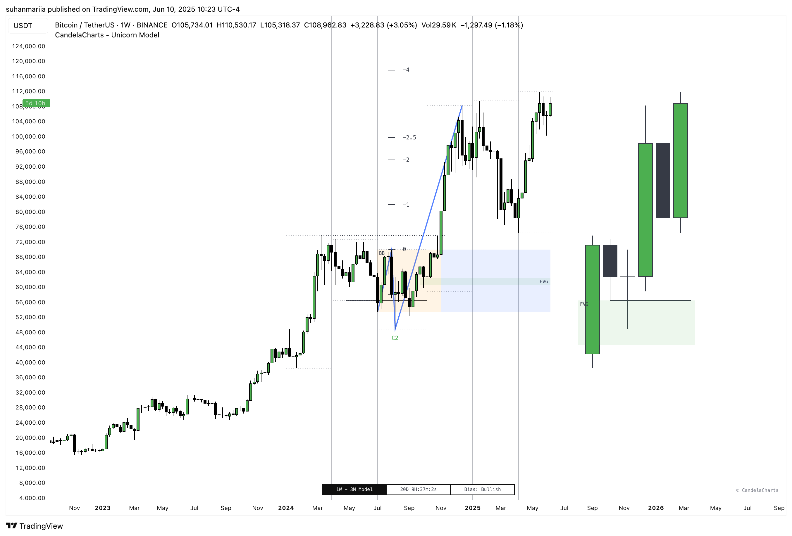

# Dashboard

The Unicorn Model Dashboard provides traders with essential, real-time information to support decision-making and enhance market analysis.

The dashboard offers two distinct display modes to optimize your viewing experience:&#x20;

* **Stack Mode:** This mode arranges indicator panels vertically, one above the other, each with its own scale, providing distinct views of various data points below the main chart.

<figure><figcaption></figcaption></figure>

* **Flat Mode:** In this mode, indicators are displayed **horizontally aligned**, often directly on the main price chart, sharing a unified perspective without vertical separation.

<figure><figcaption></figcaption></figure>

### **Bias**

This section indicates the overall market bias based on the current model and timeframe. It helps traders quickly assess whether the market is trending bullish, bearish, or neutral, providing a clear directional perspective. Understanding the market bias allows traders to align their strategies with prevailing market conditions.

### **Current Model**

The dashboard highlights the current model identified by the Unicorn Model, such as a Sweep or Market Structure Shift (MSS). This feature lets traders instantly know which market structure is active, helping them grasp underlying market dynamics and identify potential trading opportunities.

### **Remaining Time Until HTF Candle Close**

This section displays a countdown showing the time remaining until the higher timeframe (HTF) candle closes. It offers valuable insight into how much time is left for the current candle to complete, assisting with the timing of entries, exits, or model validations. This feature is especially useful for traders focused on higher timeframes who rely on key candle closures to make decisions.

### **Sessions Filter**

This filter allows users to view trading data within specific market sessions (Killzones), helping traders focus on the most relevant data during their trading hours.

### **Model Status Filter**

This filter enables users to focus on specific states or conditions of the Unicorn Model, streamlining the analysis of key trading patterns and ensuring the dashboard highlights only the most pertinent information.

The Unicorn Model Dashboard consolidates critical information—market bias, the current model, and remaining time until the HTF candle closes—into a clear, streamlined format. This enables traders to make more informed decisions and confidently navigate market conditions. With added filters and time-sensitive features, the dashboard equips traders to act quickly and effectively in a dynamic market environment.
