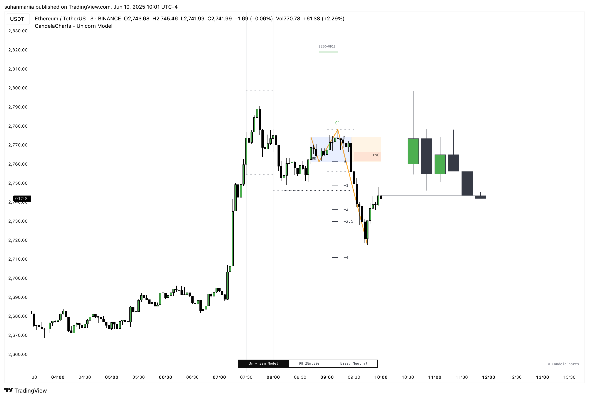
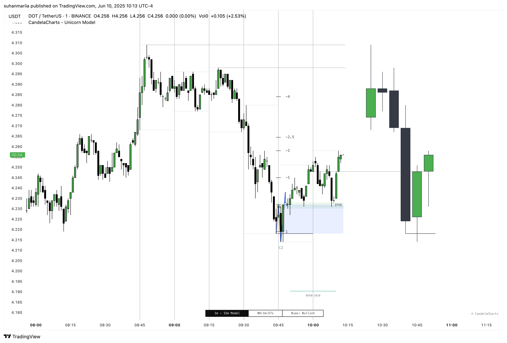

# Macros

The Unicorn Model integrates **ICT Macro Times** to identify high-probability trading windows during the global trading day.&#x20;

These time-based intervals represent key moments when institutional algorithms are most active—seeking liquidity, rebalancing, or delivering price to key levels like fair value gaps and liquidity pools.

By aligning trade setups with these macro windows, the Unicorn Model increases precision, offering clearer context for potential entries, mitigations, and reversals.&#x20;

<figure><figcaption></figcaption></figure>

Each time slot listed below is optimized for **intra-day execution**, structured around the **New York timezone (EST)**, and organized by global session activity: **London, New York, and Asia**.

### Midnight to Pre-London

<table><thead><tr><th width="218.63671875">Macro</th><th>Description</th></tr></thead><tbody><tr><td>00:50–01:10</td><td>Early algo trigger window; low liquidity sweeps may occur.</td></tr><tr><td>01:50–02:10</td><td>Pre-London liquidity positioning; often tests prior session ranges.</td></tr></tbody></table>

### London Session

<table><thead><tr><th width="218.63671875">Macro</th><th>Description</th></tr></thead><tbody><tr><td>(London) 02:33–03:00</td><td><em>London Kill Zone begins</em>; sharp displacement or FVG formation often occurs.</td></tr><tr><td>(London) 02:50–03:10</td><td>Liquidity grabs prior to London Open continuation.</td></tr><tr><td>(London) 03:50–04:10</td><td>Continuation or reversal from initial London move.</td></tr><tr><td>(London) 04:03–04:30</td><td>High-probability reversal zone; often retests FVGs or sweep highs/lows.</td></tr><tr><td>(London) 04:50–05:10</td><td>Late London expansion; can form breaker blocks or mitigation patterns.</td></tr></tbody></table>

### **Transition to NY Session**

<table><thead><tr><th width="218.63671875">Macro</th><th>Description</th></tr></thead><tbody><tr><td>05:50–06:10</td><td>London–New York overlap prep; potential for HTF structural shifts.</td></tr><tr><td>06:50–07:10</td><td>Setup window for New York price delivery; volatility builds.</td></tr><tr><td>07:50–08:10</td><td>Often a liquidity sweep or false move prior to NY open.</td></tr></tbody></table>

### NY AM Session

<table><thead><tr><th width="218.63671875">Macro</th><th>Description</th></tr></thead><tbody><tr><td>(NY AM) 08:50–09:10</td><td>NY Kill Zone begins; volatility spike likely.</td></tr><tr><td>(NY AM) 09:50–10:10</td><td>Major liquidity runs or FVG confirmations.</td></tr><tr><td>(NY AM) 10:50–11:10</td><td>Trend continuation or reversal zone after AM impulse.</td></tr></tbody></table>

### NY Lunch Session

<table><thead><tr><th width="218.63671875">Macro</th><th>Description</th></tr></thead><tbody><tr><td>(NY Launch) 11:50–12:10</td><td>Range-bound conditions, trap moves possible.</td></tr><tr><td>(NY Launch) 12:50–13:10</td><td>Can form liquidity grabs or reversal setups.</td></tr></tbody></table>

### NY PM Session

<table><thead><tr><th width="218.63671875">Macro</th><th>Description</th></tr></thead><tbody><tr><td>(NY PM) 13:10–13:40</td><td>Early PM move; continuation or false breakout.</td></tr><tr><td>(NY PM) 13:50–14:10</td><td>Algo setups for the final leg of NY session.</td></tr><tr><td>(NY PM) 14:50–15:10</td><td>Strong PM push often targeting liquidity.</td></tr><tr><td>(NY PM) 15:15–15:45</td><td>High-probability reversal or exit zone.</td></tr><tr><td>(NY PM) 15:50–16:10</td><td>Last chance for breakout or mitigation fills.</td></tr></tbody></table>

### Post-NY PM

<table><thead><tr><th width="218.63671875">Macro</th><th>Description</th></tr></thead><tbody><tr><td>16:50–17:10</td><td>Initial signs of market drift or Asia prep setups.</td></tr><tr><td>17:50–18:10</td><td>Low volume; potential for range formations.</td></tr><tr><td>18:50–19:10</td><td>Positioning for Asia session.</td></tr><tr><td>19:50–20:10</td><td>Asia Kill Zone begins; volatility returns.</td></tr></tbody></table>

### Asia Session

<table><thead><tr><th width="218.63671875">Macro</th><th>Description</th></tr></thead><tbody><tr><td>(Asia) 20:50–21:10</td><td>Early Asia session trap or setup zone.</td></tr><tr><td>(Asia) 21:50–22:10</td><td>Momentum starts to build with Asia data/events.</td></tr><tr><td>(Asia) 22:50–23:10</td><td>Final Asia volatility before tapering off.</td></tr><tr><td>(Asia) 23:50–00:10</td><td>Rebalancing or preparation for next day liquidity cycle.</td></tr></tbody></table>

Understanding and integrating ICT Macro Times within the Unicorn Model helps traders avoid low-probability setups and time their entries with greater intent.&#x20;

<figure><figcaption></figcaption></figure>

These windows are not signals by themselves—but when combined with structural elements like breaker blocks, fair value gaps, and liquidity sweeps, they provide critical context for precision trading. Always align macro times with your model phase, directional bias, and surrounding price action for optimal execution.
