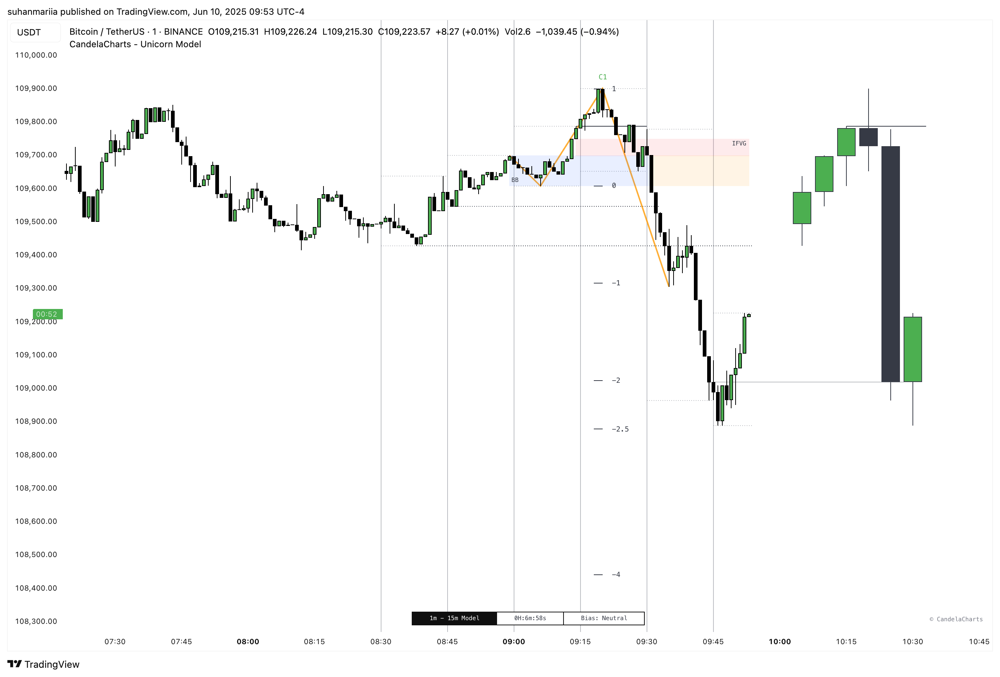

# Timeframe Pairing

Timeframe pairing is critical to successfully executing the ICT Unicorn Model. This involves combining **higher timeframe analysis** (for directional bias and key levels) with **lower timeframe execution** (for precision entries and risk management).&#x20;

<figure><figcaption></figcaption></figure>

The Unicorn Model supports the following timeframe pairing:

<table><thead><tr><th width="154.3515625">Timeframe</th><th>Description</th></tr></thead><tbody><tr><td>Automatic</td><td>Automatically selects the best timeframe pairing based on current timeframe.</td></tr><tr><td>15s - 5m</td><td>Ultra-fast scalping; micro to short-term trend detection.</td></tr><tr><td>1m - 5m</td><td>Fast intraday trades; ideal for scalping and quick setups.</td></tr><tr><td>2m - 15m</td><td>Short-term scalping to early intraday momentum.</td></tr><tr><td>3m - 30m</td><td>Intraday view with mid-term setup confirmation.</td></tr><tr><td>5m - 60m</td><td>Strong intraday to multi-hour trend tracking.</td></tr><tr><td>15m - 1H</td><td>Good for day trading; balances entry and confirmation.</td></tr><tr><td>30m - 3H</td><td>Mid-term trend analysis; swing trade positioning.</td></tr><tr><td>1H - 4H</td><td>Popular for swing trades; broader trend confirmation.</td></tr><tr><td>4H - 1D</td><td>Higher timeframe swing to weekly trend setups.</td></tr><tr><td>1D - 1W</td><td>Position trading; tracks long-term market trends.</td></tr><tr><td>1W - 1M</td><td>Long-term investment view; monthly trend strength.</td></tr><tr><td>1M - 6M</td><td>Macro trend overview; strategic investment horizon.</td></tr><tr><td>Custom</td><td>A user-defined timeframe for flexible and personalized analysis.</td></tr></tbody></table>

The Unicorn Model relies on this multi-timeframe approach to align institutional intent with intraday setups.
