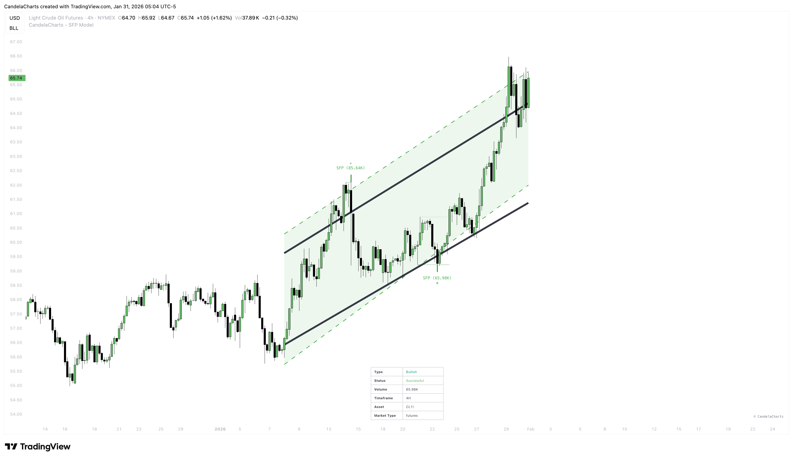
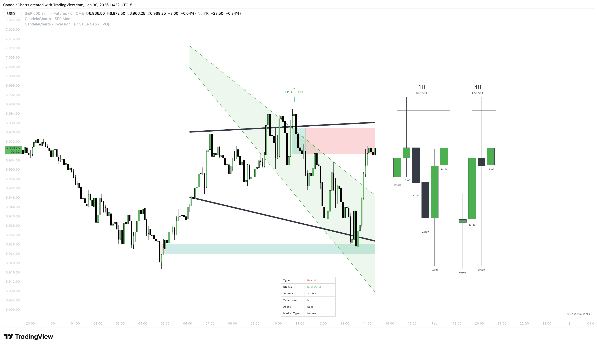
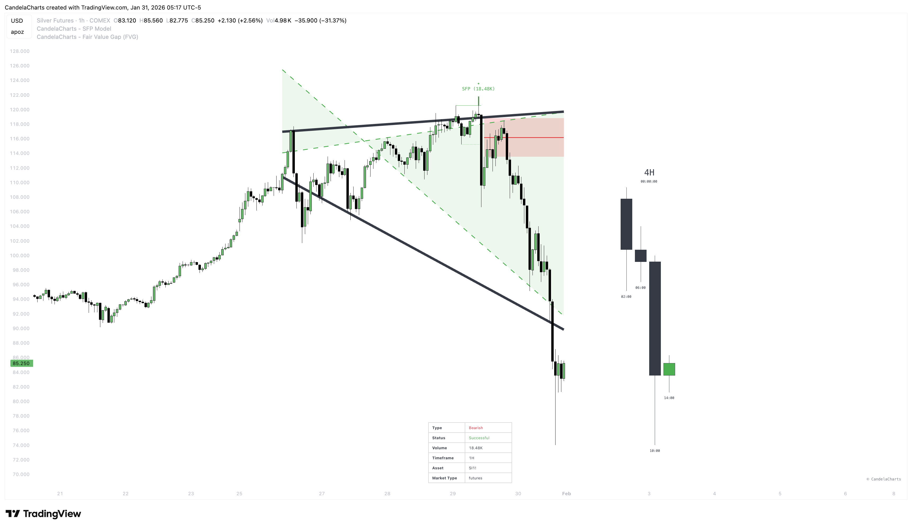

# Framework

<figure><figcaption></figcaption></figure>

The SFP Model follows this logical sequence for every potential setup:

### **Pivot Detection**&#x20;

A recent significant high (for bearish setups) or low (for bullish setups) is identified using your chosen pivot length:

* one of the 4 preset lengths
* your custom length
* or “Automatic” mode (scans multiple lengths and picks recent high-quality candidates)

### **Sweep Occurs**&#x20;

Price makes a new extreme that goes beyond the pivot level (a “liquidity grab” or fakeout), but the candle body stays on the “safe” side of the pivot:

* Bearish SFP: high goes above previous swing high, but close stays below it
* Bullish SFP: low goes below previous swing low, but close stays above it This creates the classic “failure to follow through” pattern.

### **Confirmation Check**&#x20;

The setup waits for price to close strongly in the reversal direction:

* Bullish → close above the highest point of the sweep candle
* Bearish → close below the lowest point of the sweep candle Once this happens → the SFP is **Confirmed** (turns blue).

### **Outcome Evaluation (after confirmation)**&#x20;

The model now watches how far price moves in the expected direction:

* Price reaches the **first stdev** level → **Partial Success** (lime color)
* Price reaches the **second stdev** level (stronger target) → **Successful** (green color)
* Price turns around and breaks the original swing level **or** the sweep wick extreme in the wrong direction → **Failed** (red color)

### **Invalidation (can happen at any stage before full success)**&#x20;

The setup is cancelled and marked **Invalidated** (orange) if any of these occur:

* An opposite-direction SFP appears before confirmation
* Price returns inside the original swing level without confirming
* The pattern becomes too old (roughly >500 bars) or violates internal range rules

### **Out-Of-Channel SFPs Filter (optional – enabled by default)**&#x20;

When turned on, only SFPs are shown (and alerted) where at least one of the two key wicks — either the sweep wick or the formation/succession wick — actually touches or crosses the active boundary line.

* If both trendline and channel are enabled → the channel is preferred for this check. This significantly reduces noise and focuses on setups with structural context.

### **Best Combined With: IFVGs and FVGs**

SFPs tend to deliver much stronger and more reliable signals when they form **near**, **at the edge of**, or **directly inside** Fair Value Gaps (FVGs) or Inversion Fair Value Gaps zones (IFVGs).

These imbalance areas frequently act as powerful **magnets** and high-probability **reaction zones**:

* A **bullish SFP** appearing at or near a **lower FVG/IFVG** very often triggers strong upward reversals.
* A **bearish SFP** appearing at or near an **upper FVG/IFVG** very often triggers strong downward reversals.

**Practical trading applications** of this confluence:

* Use the **SFP confirmation** as the primary **entry trigger**.
* Treat nearby/underlying **FVGs and IFVGs** as:
  * directional confluence (bias confirmation)
  * realistic **target zones** (price tends to fill or react at these levels)
  * clear **invalidation levels** (price closing through the gap often kills the setup)

**SFP + FVG/IFVG** is widely regarded as one of the cleanest and most effective confluences when trading this model in live markets.

#### IFVG Example

<figure><figcaption></figcaption></figure>

#### FVG Example

<figure><figcaption></figcaption></figure>


This combination (SFP + FVG/IFVG) is one of the most popular and effective ways to trade the model in real markets.


This flow ensures every SFP is tracked from birth → confirmation → success/failure/invalidation with clear visual feedback at each stage.
