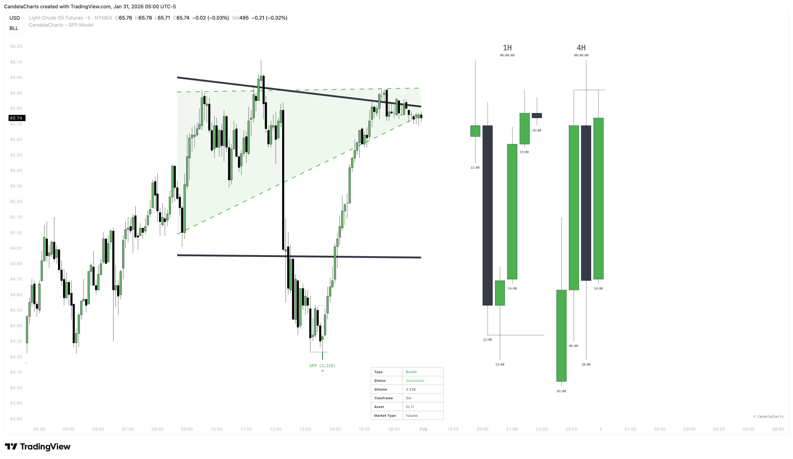

# Statuses

<figure><figcaption></figcaption></figure>

The indicator uses six mutually exclusive statuses with the following priority order (highest to lowest):

### **Invalidated (**&#x4F;rang&#x65;**)**

The potential setup was canceled before it could ever be confirmed. This usually occurs if price continues to trend through the level instead of reversing, or if too much time passes without confirmation.

### **Successful (**&#x47;ree&#x6E;**)**

The trade has reached the full profit target. This level is calculated as **2x the risk range** (a 2:1 Reward-to-Risk ratio), targeting the -2 Standard Deviation level.

### **Partial Success (**&#x4C;im&#x65;**)**

The trade is moving in your favor and has hit the first profit target. This level is calculated as **1x the risk range** (a 1:1 Reward-to-Risk ratio), targeting the -1 Standard Deviation level.

### **Failed (**&#x52;ed)

A confirmed trade setup has been stopped out. This happens if price reverses against you and breaks either the original swing point or the wick of the sweep candle (your invalidation level).

### **Confirmed (B**lu&#x65;**)**

The reversal pattern is validated and the trade is active. This signal occurs when price closes back inside the range and breaks the local structure, typically marking your entry point.

### **Unconfirmed (G**ra&#x79;**)**

A potential setup has formed where price swept a key level but rejected it. The pattern is waiting for a candle close beyond the local structure (opposing price) to confirm the reversal.
