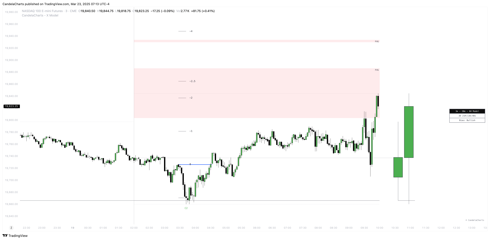

# X Model™

The **X Model** in trading refers to a structured approach that combines specific market behaviors and technical indicators to identify potential trading opportunities.

<figure><figcaption></figcaption></figure>

A prominent example is the Market Maker X Model (MMXM), which focuses on analyzing price action, liquidity zones, and market structure shifts to forecast price movements.


* This model is designed for educational and analytical purposes to study market structure, trends, and price behavior.
* It does not provide trading signals and should not be used as a substitute for independent analysis or proper risk management.
* The model is timeframe - and symbol-agnostic, automatically adapting to any market, asset, or chart it is applied to.

