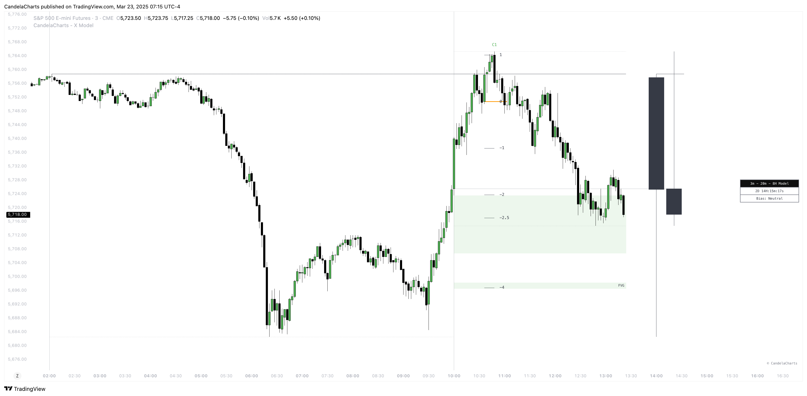

# Components

The **X Model** in trading is a methodical approach that combines key market behaviors to identify promising trading opportunities.

<figure><figcaption></figcaption></figure>

The following key components form the foundation of the X Model. Each element plays a critical role in how the model analyzes market structure, identifies trading opportunities, and guides strategic decision-making. Understanding these components is essential for effectively applying the model in real-world trading scenarios.

## Key Components

### **1D-Previous High/Low Run (ERL)**

Determines if the previous day's high or low has been broken, signaling potential shifts in market direction.

### **1H-Fair Value Gap (IRL)**

Focuses on finding an optimal entry point by targeting the 1-hour Fair Value Gap, especially around the 50% level of the previous day's price range.

### **15m-Smart Money Technique (SMT)**

Utilizes SMT indicators to verify the market structure shift, ensuring alignment with institutional trading patterns.

### **15m-Change In State Of Delivery (CISD)**

Examines changes in market structure on a 15-minute chart to confirm the trend direction established by the previous day's high/low breakout.


The traditional model identifies Market Structure Shifts (MSS) based on candle wicks, while the Change In State of Delivery (CISD) approach focuses on candle bodies—an approach utilized in our model’s algorithm.

