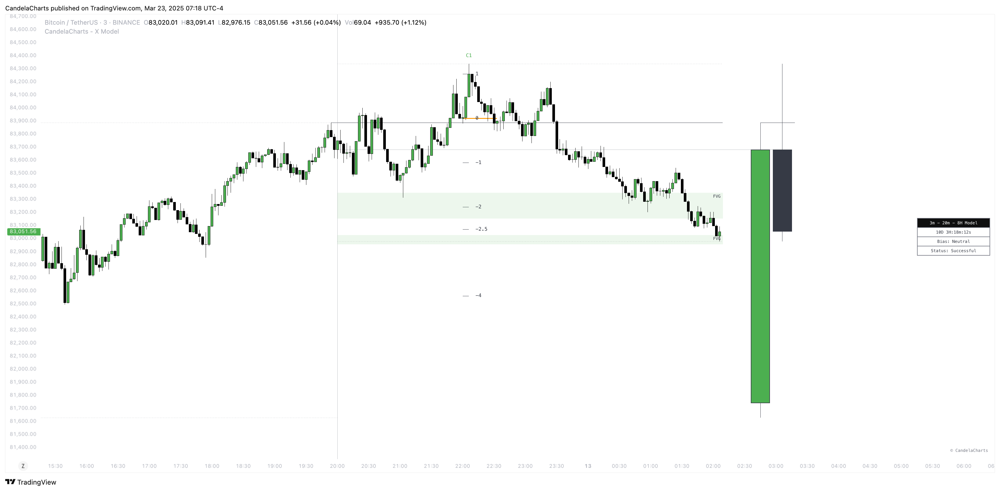

# Dashboard

The **X Model** Dashboard equips traders with essential, real-time insights to enhance decision-making and refine market analysis.&#x20;

<figure><figcaption></figcaption></figure>

Designed to display key data points, the dashboard offers a clear, comprehensive view of current market conditions and chart behavior.

The following key metrics are provided:

### **Bias**

This section reveals the overall market bias based on the current X Model and timeframe, allowing traders to quickly assess whether the market is trending bullish, bearish, or neutral. Understanding the bias helps traders align their strategy with prevailing market conditions.

### **Current Model**

The dashboard highlights the active model identified by the X Model, such as market structure shifts or liquidity zone breakouts. This feature provides traders with immediate clarity on the current market phase, helping them understand the dynamics at play and spot potential opportunities.

### **Remaining Time Until HTF Candle Close**

A countdown shows how much time remains until the higher timeframe (HTF) candle closes. This is crucial for timing entries, exits, or validating model setups, particularly for traders focused on higher timeframes.

### **Sessions Filter**

This filter allows users to view trading data within specific market sessions (Killzones).

### **Model Status Filter**

This filter enables users to focus on specific states or conditions of the trading model.

### Conclusion

The X Model Dashboard consolidates key metrics such as market bias, the current model, and the time remaining until the HTF candle closes.&#x20;

With this streamlined presentation, traders can make more informed decisions, improving their ability to navigate market movements with greater confidence and precision.
