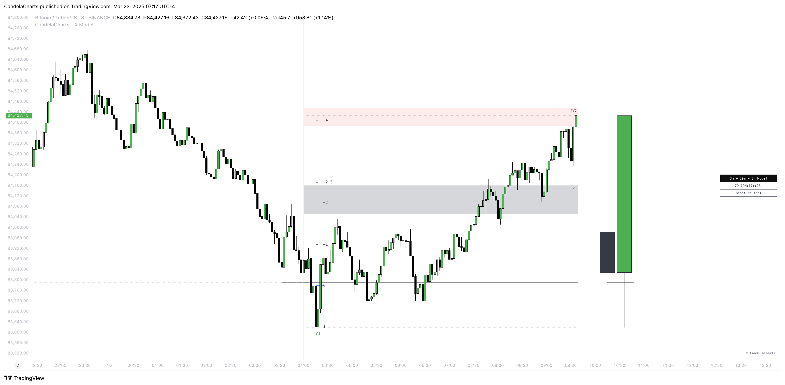

# Framework

The X Model trading framework offers a structured approach for identifying high-probability trading opportunities by combining key technical indicators, market structure analysis, and timing strategies to guide both long and short entries.

<figure><figcaption></figcaption></figure>

## **How it works?**

Below, you'll find a comprehensive set of rules that explain how the model operates and how it should be properly applied in practice. These guidelines are intended to ensure consistent use, improve decision-making, and help you get the most out of the model across different market conditions and timeframes.

### **Short Entry Checklist**

1. **Previous Day High (ERL):** Price breaks or tests the previous (day’s) high.
2. **H1 Bullish FVG (IRL):** A **Bullish FVG** on the 1-hour chart is present, indicating a potential target for a short opportunity.
3. **m15 CISD / SMT:** Confirm the bearish market structure on the 15-minute chart, supported by Smart Money confirmation (e.g., divergence, volume analysis).
4. **Above 00:00:** Only enter short trades **above 00:00**, on CISD after the market’s daily reset.

### **Long Entry Checklist**

1. **Previous Day Low (ERL):** Price breaks or tests the previous day’s low, indicating a potential support level.
2. **H1 Bearish FVG (IRL):** A **Bearish FVG** on the 1-hour chart is present, signaling a potential target for a long opportunity.
3. **m15 CISD / SMT:** Confirm the bullish market structure on the 15-minute chart, supported by Smart Money confirmation (e.g., volume, divergence).
4. **Below 00:00:** Only enter long trades **below 00:00**, on CISD before the market’s daily reset.

By following these rules, the X Model provides a structured approach for identifying high-probability entry points for both long and short trades.


The long and short entries illustrate how the strategy works using one specific timeframe combination—15m, 1H, and 1D. However, the same principles can be applied to other timeframe pairings as well that are present in the model.


Traders can systematically use the **Previous Day High/Low**, **Fair Value Gaps**, **Change In State Of Delivery**, and **Smart Money Technique** to confirm their entries, ensuring alignment with broader market trends and institutional activity.

The added constraint of entering trades only **above or below 00:00** helps to focus on the optimal timing of market entries.
