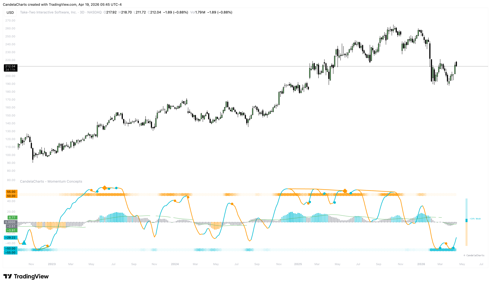

# Confidence Meter

The **Confidence Meter** is the brain of Momentum Concepts. It aggregates all data into a single readability gauge that scores the current market's conviction.

<figure><figcaption></figcaption></figure>

### Score Calculation

The meter scores from **-100% (Maximum Bearish)** to **+100% (Maximum Bullish)**.

1. **MW Trend Weight**: How well is the Momentum Wave trending?
2. **MFI Flow Weight**: Is volume supporting the current move?
3. **Stretch Penalties**: If the momentum is too overextended, the confidence meter applies a "Penalty" to account for potential exhaustion.

### Visual Categories

* **Weak (< 25%)**: Momentum is present but lacks conviction. High chance of chop.
* **Moderate (25% - 50%)**: A developing trend is forming.
* **Strong (> 50%)**: A high-conviction trend is in play. The further the meter stretches toward 100%, the more "Intense" the conviction.

### Meter Display

Found at the far right of the indicator pane, the vertical bar provides an instant summary:

* **Rising Blue Bar**: Confident Bullish participation.
* **Falling Orange Bar**: Confident Bearish participation.
