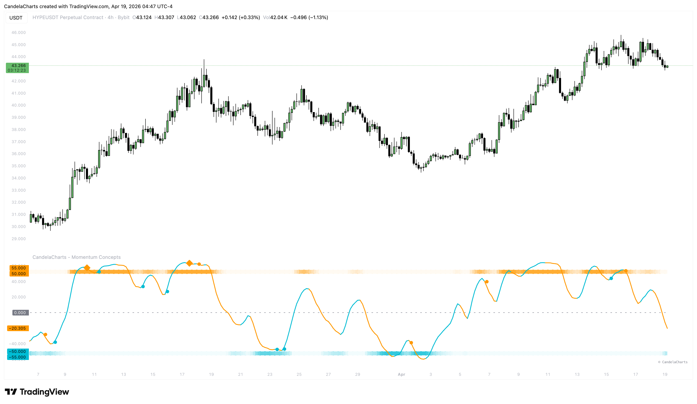

# Momentum Wave

The **Momentum Wave** is the heartbeat of the indicator. It uses Ehlers SuperSmoother technology and Exponential Smoothing to create a "Lag-Less" momentum line.

<figure><figcaption></figcaption></figure>

### Calculation Logic

1. **ESA Baseline**: Calculates an Exponential Smoothed Average of the Typical Price.
2. **Cycle Identification**: Extracts the cyclical components of price movement.
3. **SuperSmoothing**: Applies a 2-pole Butterworth filter to eliminate aliasing and market noise without introducing significant lag.
4. **Soft Limiting**: Compresses extreme values (Hard-Capped at ±70) to keep the oscillator readable even during parabolic moves.

### Interpretation

* **Bullish Wave (Color 1)**: The wave is rising and above its signal line. Trend is positive.
* **Bearish Wave (Color 2)**: The wave is falling and below its signal line. Trend is negative.
* **Mid-Line (0)**: The equilibrium point. Crosses indicate a flip in trend direction.
* **Intensity Heatmap**: The background zones (OB/OS Boxes) change in transparency based on **Volatility-Momentum Intensity**, showing you where the wave is under the most pressure.
