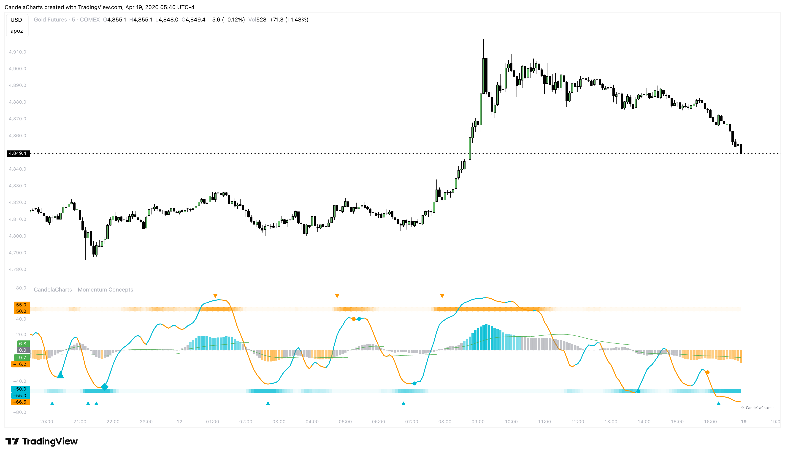

# Reversals

The **Reversal Engine** is one of the most advanced components of Momentum Concepts. It uses a **K-Nearest Neighbors (KNN)** algorithm to calculate the statistical probability of a top or bottom.

<figure><figcaption></figcaption></figure>

### How KNN Works

1. **Feature Extraction**: It tracks 8 dimensions of momentum (CCI over multiple timeframes).
2. **Historical Comparison**: Every new candle, the engine looks back at your "Max Samples" and finds the "K" most similar historical patterns.
3. **Probability Scoring**:
   * If most similar patterns in the past led to a bottom, the **Bottom Probability** increases.
   * If they led to a top, the **Top Probability** increases.

### Signal Threshold

By default, the **Signal Threshold** is set to 80%. When the probability of a reversal crosses this line, the engine is "Primed".

### Reversal Markers

* **Upward Triangle**: Triggers when the Bottom Probability crosses back under the threshold after reaching an extreme. Indicates a confirmed bottoming pattern.
* **Downward Triangle**: Triggers when the Top Probability crosses back under the threshold after reaching an extreme. Indicates a confirmed topping pattern.

### Sensitivity

* **K-Value**: Lower values make the engine more sensitive; higher values make it more stable.
* **Max Samples**: Increasing this provides more historical context but requires more processing power.
