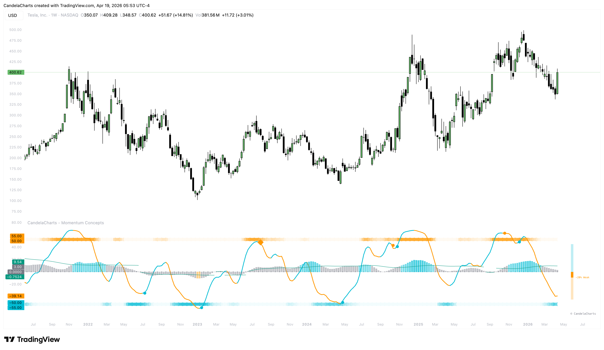

# Signals

Momentum Concepts classifies signals into three levels of conviction based on the synergy between the Momentum Wave, MFI, and the Confidence Engine.

<figure><figcaption></figcaption></figure>

### Signal Levels

1. **Standard (L1) - Circle Marker**:
   * **Logic**: Base momentum reversal detected (Momentum Wave crossover) with standard confidence support.
2. **Strong (L2) - Diamond Marker**:
   * **Logic**: Confirmed momentum shift with **Moderate Confidence (> 25%)** and supporting capital flow.
3. **Elite (L3) - Triangle Marker**:
   * **Logic**: High-conviction setup where momentum, volume flow, and the Confidence Meter are all in alignment at **Strong levels (> 35%)**.

### Signal Filtering

Through the settings, you can filter which signals appear on your chart:

* **Aggressive**: Shows almost all reversals as soon as they meet the base L1 criteria.
* **Balanced**: Filters for signals that have a verified confidence build.
* **Conservative**: Only shows signals that have significant trend support or reversal context.
