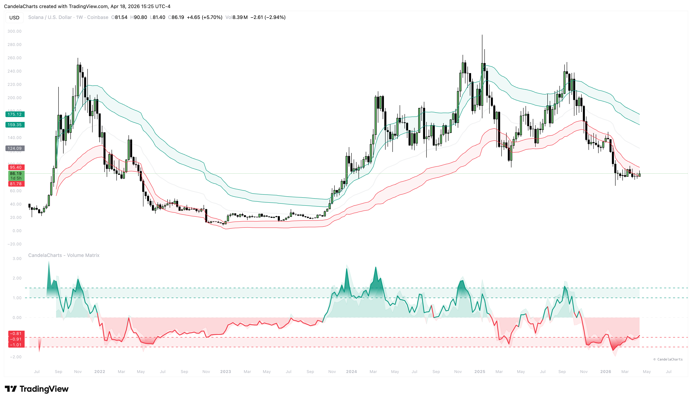
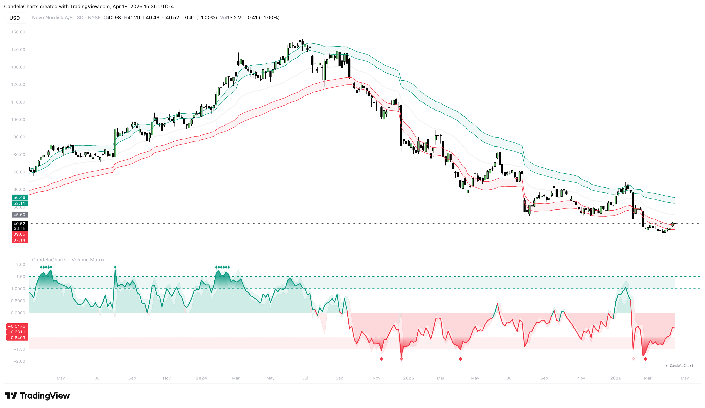

# Overbought & Oversold

In the Volume Matrix, Overbought and Oversold conditions are not static levels but are dynamically generated based on the current market's statistical distribution.

<figure><figcaption></figcaption></figure>

### Understanding the Zones

The indicator defines two primary zones for both Overbought (OB) and Oversold (OS):

1. **Inner Zone (Level ±1.0)**:
   * This represents the first threshold of extension.
   * When the Volume Line enters this zone, the market is becoming stretched.
   * Entering this zone is often a sign of high momentum but also a warning of potential mean reversion.
2. **Outer Zone (Level ±1.5)**:
   * This represents extreme statistical extension.
   * Remaining in this zone for multiple bars indicates an "Exhaustion" phase or a parabolic move.
   * Reversals from this zone are typically much more violent.

### Interpretation

* **Entering OB (> 1.0)**: Buying power is high. Look for signs of weakness if it fails to sustain the move.
* **Leaving OB (< 1.0)**: A sign that momentum is waning and a reversal or correction may be starting.
* **Entering OS (< -1.0)**: Selling pressure is extreme. Sellers are likely becoming exhausted.
* **Leaving OS (> -1.0)**: A sign that the selling climax has passed and buyers are potentially stepping in.

### Visual Symbols for State Awareness

<figure><figcaption></figcaption></figure>

To provide immediate visual feedback without checking the level numbers, the Volume Matrix uses stylized icons:

* **Intensity Gradients**: Dynamic vertical fills that activate at the ±1.0 thresholds, growing more opaque as the market becomes increasingly over-extended.
* **Exhaustion Markers** (✦/❖): Stylized star and diamond icons that appear at the ±1.5 statistical boundaries to signal deep trend exhaustion.

These symbols can be toggled on or off in the **Oscillator Zones** settings group.
