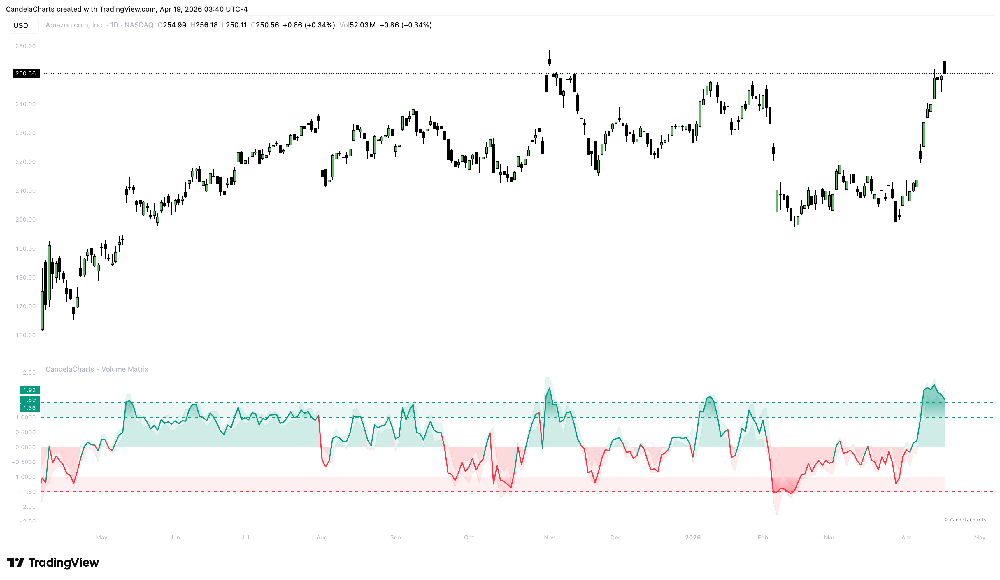

# The Math

The **Volume Matrix** is a sophisticated, non-linear oscillator designed to measure the synergy between price action and volume intensity. Unlike traditional oscillators that treat every price change with equal weight, the Volume Matrix uses an **Elastic Volume-Weighting** engine and a **Student-T Distribution** model to filter market noise and identify high-probability exhaustion points.

<figure><figcaption></figcaption></figure>

By understanding the logic behind its volume weighting and visual area plotting, traders can better interpret the "gravity" of market moves and distinguish between sustainable trends and volatile spikes.

### Logic Components&#x20;

* Elastic Volume Weighting (The Alpha)
* Area Plotting & Normalization
* Student-T Distribution Statistics
* Numerical Stability (Incremental Variance)

### 01. Elastic Volume Weighting&#x20;

The core of the Volume Matrix is its adaptive responsiveness. It uses a dynamic "Alpha" factor to determine how much the current bar should influence the fair value mean.

#### The Calculation

The indicator maintains a running sum of volume (with a decay factor based on your lookback period): _weight\_sum = current\_volume + (decay\_factor \* previous\_weight\_sum)_

The "Alpha" (or responsiveness) is then calculated as: **Alpha = Current Volume / Rolling Volume Sum**

#### Interpretation

* **High Volume Bars**: On a high-volume breakout, the Alpha increases significantly. This causes the indicator's "Fair Value Mean" to snap quickly toward the new price, treating the move as high-conviction institutional participation.
* **Low Volume Bars**: On low-volume wicks or "fakeouts," the Alpha remains low. The mean stays anchored, causing the oscillator to show extreme extension, signaling that the price move lacks the "mass" to sustain itself.

### 02. Area Plotting & Normalization&#x20;

The Volume Matrix visualizes market data as a "Mountain" or "Cloud" in the indicator pane using the **Area Plot** style.

#### Normalization Logic

To make the data comparable across different assets and timeframes, the indicator normalizes the price relative to its Volatility Bands (Upper σ and Lower σ): **Normalized Value = 2 \* ( (Price - Lower Band) / (Upper Band - Lower Band) - 0.5 )**

This scales the data so that:

* **0.0** represents the volume-weighted fair value (Equilibrium).
* **±1.0** represents the "Intensity" thresholds (Robust Standard Deviation).
* **±1.5** represents "Exhaustion" (Standard Deviation limits).

#### The Area Visual&#x20;

The indicator plots the **High** and **Low** range as solid areas expanding from the zero line.

* This creates a visual "mass" that represents the intraday range.
* A thick, solid cloud indicates a wide range bar with high volatility.
* A thin or pinched area indicates consolidation and lack of range.

### 03. Student-T Distribution Statistics&#x20;

Most traditional indicators assume a "Normal Distribution" (the Bell Curve). However, financial markets are known for **"Fat Tails"**—extreme events happen far more frequently than a normal curve predicts.

The Volume Matrix leverages the **Student-T Distribution**, which is more robust and less prone to being skewed by outliers.

* **Degrees of Freedom (DoF)**: The indicator dynamically adjusts its shape. When the market is quiet, it mimics a normal distribution. When volatility spikes and the data becomes "heavy-tailed" (High Kurtosis), the DoF decreases, making the bands more "elastic" and harder to breach without significant volume support.
* **Robust Sigma**: Unlike standard deviation which can be "tricked" by one massive spike, the robust scale calculation looks at the absolute deviation, ensuring the bands remain stable even during chaotic news events.

### 04. Numerical Stability (Tony Finch Model)&#x20;

To ensure the indicator remains accurate over thousands of bars without "drifting" or suffering from floating-point errors, it uses a modified **Tony Finch Model** for variance calculation.

This involves an incremental update method where the mean and variance are updated bar-by-bar rather than recalculated from scratch in a large loop. This results in:

* **Lower Latency**: Faster calculations for real-time trading.
* **Long-Term Accuracy**: The fair value mean remains precise regardless of how many days of data are loaded on the chart.
