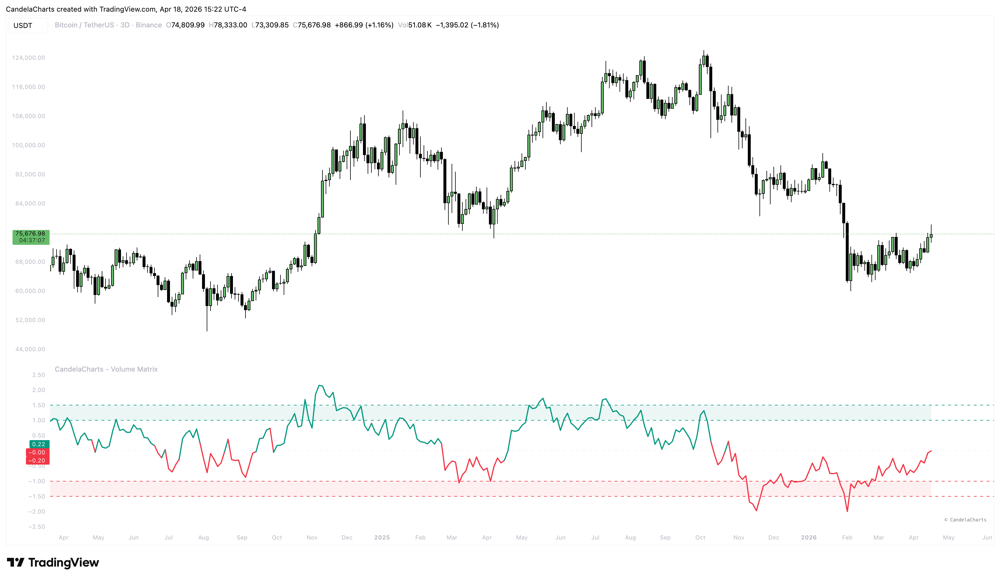
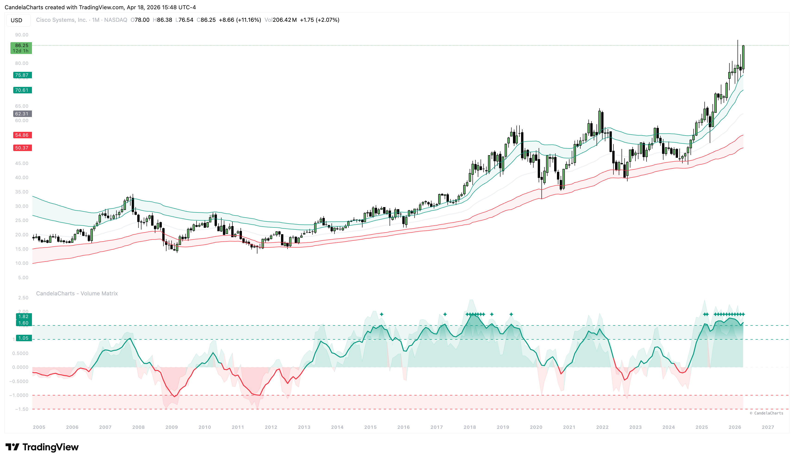
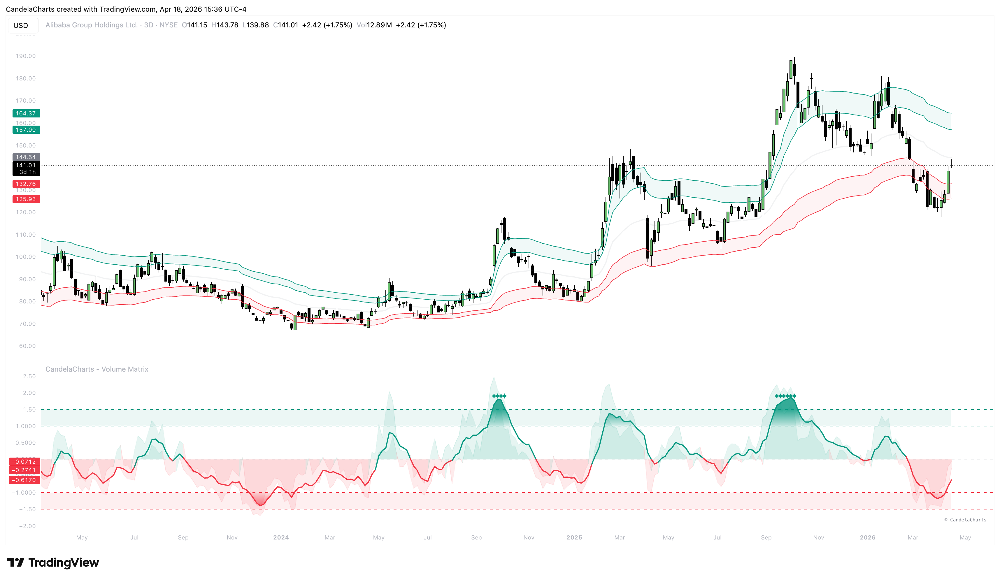

# Volume Line

The **Volume Line** is the primary signal generator within the Volume Matrix. It tracks the real-time relative momentum of price, heavily influenced by volume participation. It is designed to act as a "Single Source of Truth" for where price sits within the current volatility context.

<figure><figcaption></figcaption></figure>

### The Normalization Process

The Volume Line doesn't just show price; it shows price **relative to its environment**.&#x20;

<figure><figcaption></figcaption></figure>

It uses the following normalization logic:

* **The Baseline**: The indicator calculates the distance between the **Upper Band (ub\_x2)** and **Lower Band (bb\_x2)**.
* **The Position**: It then determines where the current Close price sits within that range.
* **The Scaling**: This value is scaled so that:
  * **0.0** is the exact midpoint (The volume-weighted mean).
  * **+1.0** is the upper volatility limit.
  * **-1.0** is the lower volatility limit.

This means that a Volume Line at 0.5 tells you that the price is halfway between the fair-value mean and the upper extreme, regardless of the asset's actual price in dollars.

### Smoothing

<figure><figcaption></figcaption></figure>

To ensure the signal is usable for traders, the Volume Line includes an optional **Smoothing** feature:

* **Unsmoothed (Raw)**: Captures every tick and micro-shift in momentum. Useful for fast scalpers.
* **Smoothed (EMA)**: Uses an Exponential Moving Average to filter out market noise and wicks. This provides a much clearer view of the "core" trend and reduces the number of false zero-line crossovers.

### Visual Cues

The Volume Line provides instant visual feedback through its color and position:

* **Teal Line (Bullish Regime)**: When the line is above **0.0**, it is colored teal (default), indicating that buyers are in control and the price is in the upper half of its volatility range.
* **Red Line (Bearish Regime)**: When the line is below **0.0**, it is colored red (default), indicating that sellers are in control.
* **Histbase Interaction**: The line is plotted against a histogram base of 0.0, making it easy to identify **Regime Shifts** (crosses of the zero line).

### Practical Usage

* **Ascension/Descension**: Watch for the _slope_ of the line. A steepening slope indicates accelerating momentum.
* **Zero-Line Rejections**: If the line approaches 0.0 but bounces off it, it confirms that the current regime is very strong and the mean is acting as support/resistance.
* **Crossovers**: A Zero-Line Crossover is a primary signal of a trend change.
