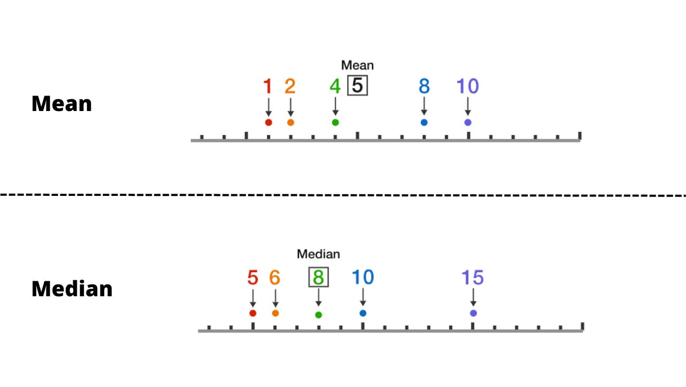

# Calculation

The **OHLC Expansion Map** is a sophisticated tool designed to provide deeper insights into market dynamics by analyzing candlestick data using two core statistical methods:

* **Mean**
* **Median**

These methods, coupled with insights into manipulation and distribution phases, empower traders to make more informed decisions based on price action.

### The Behavioral Formula

For every period (Day, Session, Macro), the indicator tracks four specific metrics:

1. **Bullish High Range:** `High - Open` (on bullish bars)
2. **Bullish Low Range:** `Open - Low` (on bullish bars)
3. **Bearish High Range:** `High - Open` (on bearish bars)
4. **Bearish Low Range:** `Open - Low` (on bearish bars)

### **Mean vs. Median**

When building a statistical picture of market behavior — say, tracking daily point ranges on NQ — mean and median tell you different things.&#x20;

<figure><figcaption></figcaption></figure>

Knowing which to trust in a given context is what separates clean analysis from misleading data.

#### **1.1. Mean — The Overall Average**&#x20;

Add all values, divide by the count:

* Values: 132, 197, 198, 210, 350
* Sum = 1087
* Mean = 1087 / 5 = **217.4**

Simple enough — but the problem is sensitivity. That 350-point session, likely driven by a high-impact catalyst like NFP, FOMC, or CPI, pulls the average up and makes the "typical" day look bigger than it actually is.

#### **1.2. Median — The True Middle**&#x20;

Sort the same values and take the center figure:

* Sorted Values: 132, 197, **198**, 210, 350
* Median = **198**

No weighting, no distortion. The outlier exists in the data set, but it no longer dominates the result. What you're left with is a number that better represents what a normal session actually looks like.

When studying market movements, traders often look at price ranges to gauge trends and volatility. These ranges can be expressed either in points or percentages, and each approach offers a different perspective on how the market behaves over time. Here’s a clearer look at how they differ and why it matters.
