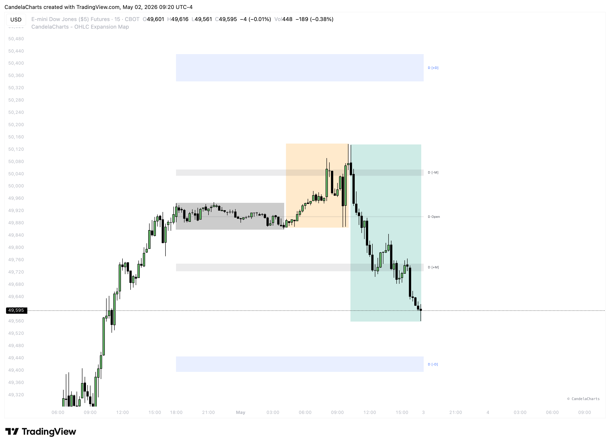

# AMD (PO3)

<figure><figcaption></figcaption></figure>

The ICT Power of Three (PO3/AMD) is a trading strategy developed by Michael Huddleston, also known as "The Inner Circle Trader" (ICT). It aims to help traders identify and capitalize on market movements driven by institutional investors, often referred to as "smart money." The strategy is structured around three distinct phases: Accumulation, Manipulation, and Distribution.

### **1. Accumulation Phase**

In this initial phase, smart money quietly builds positions within a narrow price range, often during low-volatility periods such as the Asian trading session. This consolidation creates liquidity on both sides of the market, setting the stage for future price movements.

### **2. Manipulation Phase**

Following accumulation, prices are deliberately moved to trigger retail traders' stop-loss orders, creating false breakouts. This manipulation misleads traders into entering positions that are later reversed, allowing smart money to accumulate more favorable positions.

### **3. Distribution Phase**

In the final phase, smart money drives the market in the intended direction, capitalizing on the liquidity created during the manipulation phase. This phase often results in strong price movements that align with the initial accumulation, leading to significant profits for those who correctly identify the preceding phases.

<figure><figcaption></figcaption></figure>

### **Applying It Practically with OHLC Expansion Map**&#x20;

The **OHLC Expansion Map** overlays a statistical framework directly onto the Power of Three cycle, giving each phase a defined price boundary to trade against. This logic applies across all timeframes, from the Daily (1D) macro view down to specific intraday windows.

#### Institutional Signatures

The key levels identify where institutional algorithms typically transition from one phase to the next:

* **Open (+ O):** The anchor for the cycle. Price frequently returns to this level during accumulation before the expansion begins.
* **Manipulation Bands (± M):** These zones represent the high-probability area for the "fake-out" move. A sweep into these levels is where liquidity is hunted before the real distribution kicks off.
* **Distribution Bands (± D):** The ultimate targets for the move. Price reaching these extremes signals maximum expansion and a likely reversal or exhaustion point.

#### Sessions and Macros

The Power of Three is fractal, meaning it repeats within smaller time windows throughout the day:

* **Session PO3:** The indicator tracks specific sessions (Asia, London, NY AM/PM). You can observe an **Asia Accumulation** phase leading into a **London Manipulation** (sweep of the ±M zones) and a **New York Distribution**.
* **Macro PO3:** Within high-intensity 20-60 minute **Macros**, algorithms often deliver a mini-AMD cycle. The map provides dedicated behavioral levels for each macro, allowing you to catch the manipulation phase within these specific institutional windows.

In practice, when price sweeps into the **1D ± M zone** and stalls, that's the manipulation phase completing. The distribution leg then typically targets the **1D Avg H or Avg L**, with the **1D ± D** acting as the extreme scenario extension. Trading this way means you're not chasing — you're waiting for price to reach a statistically defined level, confirming the trap, and entering ahead of the real move.
