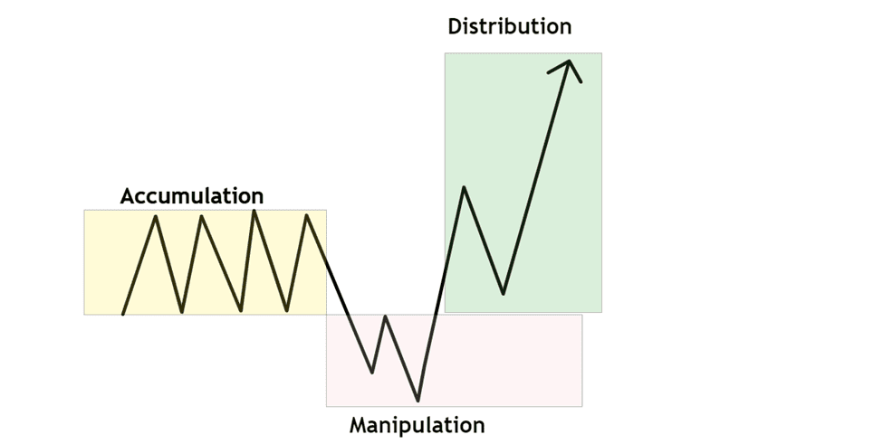
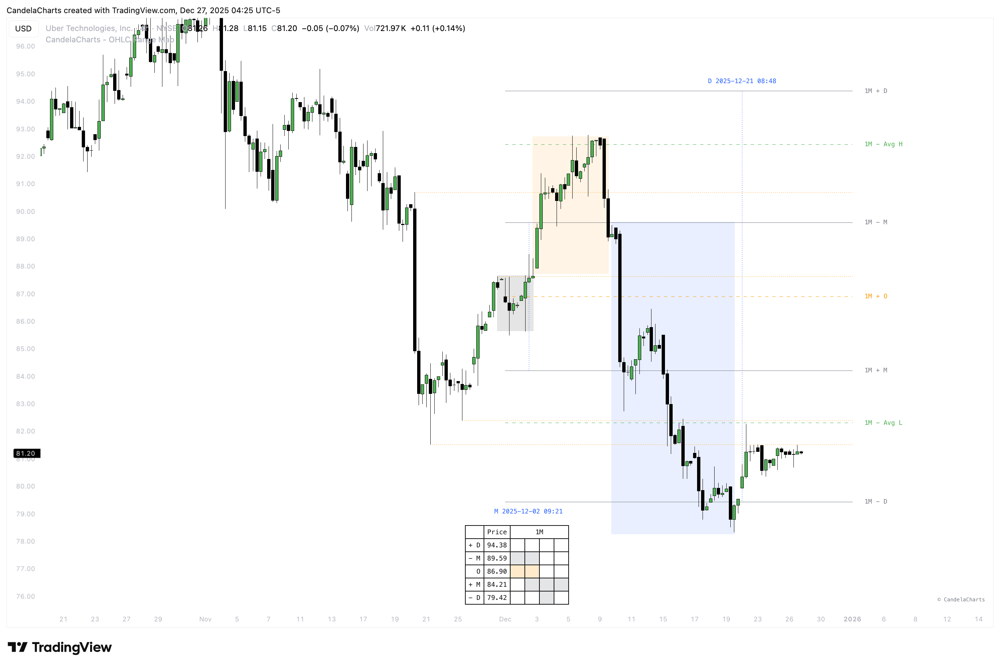

# AMD (PO3)

<figure><figcaption></figcaption></figure>

The ICT Power of Three (PO3/AMD) is a trading strategy developed by Michael Huddleston, also known as "The Inner Circle Trader" (ICT). It aims to help traders identify and capitalize on market movements driven by institutional investors, often referred to as "smart money." The strategy is structured around three distinct phases: Accumulation, Manipulation, and Distribution.

### **1. Accumulation Phase**

In this initial phase, smart money quietly builds positions within a narrow price range, often during low-volatility periods such as the Asian trading session. This consolidation creates liquidity on both sides of the market, setting the stage for future price movements.

### **2. Manipulation Phase**

Following accumulation, prices are deliberately moved to trigger retail traders' stop-loss orders, creating false breakouts. This manipulation misleads traders into entering positions that are later reversed, allowing smart money to accumulate more favorable positions.

### **3. Distribution Phase**

In the final phase, smart money drives the market in the intended direction, capitalizing on the liquidity created during the manipulation phase. This phase often results in strong price movements that align with the initial accumulation, leading to significant profits for those who correctly identify the preceding phases.

<figure><figcaption></figcaption></figure>

### **Applying It Practically with OHLC Range Map**&#x20;

The OHLC Range Map overlays a statistical framework directly onto the Power of Three cycle, giving each phase a defined price boundary to trade against. The key levels are:

* **1D + D / 1D − D** — The outer distribution bands. Price reaching these extremes signals maximum extension and a likely reversal or exhaustion zone.
* **1D Avg H / 1D Avg L** — The average high and low zones. These are the most common targets for the distribution leg — where smart money typically completes its move.
* **1D + M / 1D − M** — The manipulation bands. A sweep into these zones is the classic manipulation signature — stops are hunted here before the real move begins.
* **1D + O** — The session open level. Price frequently returns to the open during accumulation before the directional leg kicks off.

In practice, when price sweeps into the **1D ± M zone** and stalls, that's the manipulation phase completing. The distribution leg then typically targets the **1D Avg H or Avg L**, with the **1D ± D** acting as the extreme scenario extension. Trading this way means you're not chasing — you're waiting for price to reach a statistically defined level, confirming the trap, and entering ahead of the real move.
