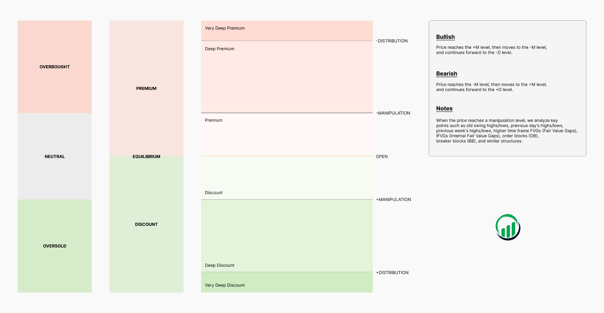

# Premium & Discount

Learn how to identify premium and discount zones to spot areas where price may reverse. These zones highlight when the market is potentially overbought or oversold.

<figure><figcaption></figcaption></figure>

### **Bullish Bias**

In simple terms, prices below the opening are considered _discount_, while prices above the opening are _premium_.

With a bullish outlook, the goal is to buy when price is in a discount zone—essentially when it’s cheaper. Statistically, the session low (or the candle’s low) tends to align with the \[+]Manipulation (\[+]M) level.

Within this structure, three potential buying zones can be defined:

* **Discount**: Any price below the opening level
* **Deep Discount**: Price drops below the \[+]M level, exceeding the typical downside range before a bullish reversal
* **Very Deep Discount**: Price moves below the \[-]Distribution level, which marks the statistical low of bearish sessions—indicating heavily oversold conditions

### **Bearish Bias**

In a bearish scenario, prices above the opening are considered _premium_, and the focus shifts to selling at higher (more expensive) levels. The session high (or candle high) often aligns with the \[-]Manipulation (\[-]M) level.

Similarly, three selling zones can be outlined:

* **Premium**: Any price above the opening level
* **Deep Premium**: Price rises above the \[-]M level, surpassing the usual upward range before reversing downward
* **Very Deep Premium**: Price exceeds the \[+]Distribution level, the statistical high of bullish sessions—suggesting overbought conditions

### **Liquidity Pools & Manipulation Levels**

Combining liquidity pools—such as session highs/lows or previous day highs/lows—with manipulation levels can significantly improve trade setups. These areas often attract liquidity, and when price reaches them near a manipulation level, large orders can trigger strong reversals.

* **Liquidity Sweeps & Reversals**: When price breaks a key level (like a session high/low) and aligns with a manipulation level, it may signal a high-probability reversal as liquidity is taken and momentum weakens.
* **Extreme Zones**: If price reaches extreme premium or discount levels while interacting with liquidity pools, it may indicate exhaustion and a potential turning point.

By combining these concepts, traders can better identify high-probability opportunities where institutional activity may drive significant price movements.
