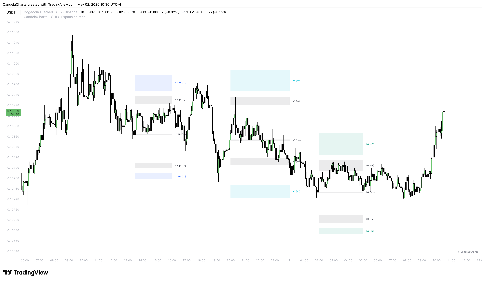

# Sessions

<figure><figcaption></figcaption></figure>

The market moves in cycles of time. The **Sessions** component of the OHLC Expansion Map provides precision mapping for specific trading windows where institutional volatility is highest.

### Predefined Sessions

The indicator comes with several industry-standard sessions pre-configured:

* **Asia Session (AS):** 20:00 - 00:00 (NY Time). Often characterized by accumulation or consolidation.
* **London Open (LO):** 02:00 - 05:00 (NY Time). The "Killzone" where the daily high or low is often formed.
* **NY AM Session (NYAM):** 09:30 - 11:00 (NY Time). High-intensity expansion following the equities open.
* **NY Lunch (NY LA):** 12:00 - 13:00 (NY Time). Typically a period of retracement or consolidation.
* **NY PM Session (NYPM):** 13:30 - 16:00 (NY Time). Late-day distribution or trend continuation.

### Custom Sessions

If you trade specific markets (like London Equities, Crypto, or Forex pairs with specific news events), you can use the **Custom Session** slot. Simply enter the time in `HHMM-HHMM` format.

### Features

#### NY Midnight Open

For all session-based statistics, you have the option to anchor the "Daily Open" to the New York Midnight price. This is critical for ICT-based trading strategies where the "True Day" begins at 00:00 EST.

#### Dynamic Zone Extension

* **End of Period:** Zones extend from the session start to the calculated session end time.
* **Current Bar:** Zones extend dynamically to the current time, providing a live "real-time" view of the expansion.

### Best Practices

* **Color Coding:** Use distinct colors for each session to quickly identify which "Killzone" you are currently trading in.
* **Overlap Analysis:** Look for instances where a Higher Timeframe (TF2) Distribution zone overlaps with a Session (LO) Manipulation zone—these are often high-probability reversal points.
