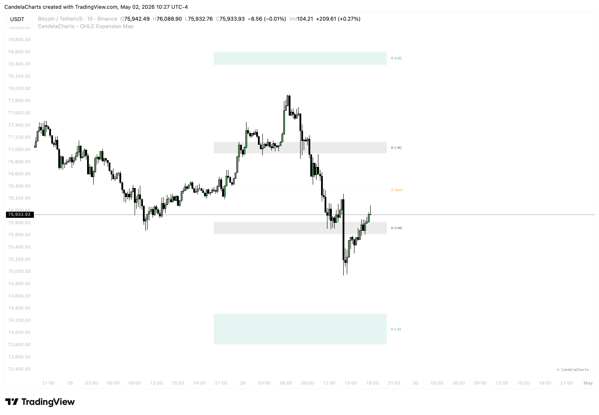

# Timeframes

<figure><figcaption></figcaption></figure>

The **OHLC Expansion Map** is built on the principle of market fractality. Institutional algorithmic price delivery follows the same behavioral patterns whether you are looking at a Yearly, Monthly, Daily, or 15-minute timeframe.

### Multi-Timeframe

The indicator provides four dedicated timeframe slots (**TF1 through TF4**) that can be enabled and configured independently. This allows you to project Higher Timeframe (HTF) behavioral levels directly onto your trading timeframe.

#### Available Timeframe Inputs

You can select from any of the standard TradingView timeframes, including:

* **12M** (Yearly)
* **3M / 1M** (Quarterly / Monthly)
* **1W** (Weekly)
* **1D** (Daily)
* **240 / 60** (4-Hour / 1-Hour)
* **15 / 5 / 1** (Intraday minutes)


You are not limited to these defaults. You can manually type in **any custom timeframe** supported by TradingView (e.g., `2D`, `3H`, `90m`, `2W`) into the timeframe input field.


### Common Configurations

* **The Swing Trader:** TF1: 1M | TF2: 1W | TF3: 1D
* **The Day Trader:** TF1: 1W | TF2: 1D | TF3: 4H | TF4: 1H
* **The Scalper:** TF1: 1D | TF2: 4H | TF3: 1H | TF4: 15m

### Visual Abbreviation

To keep your chart clean while using all 4 TF slots, enable the **"Abbreviate Labels"** setting. This will change long labels like `[1D] Distribution` to shorter codes like `[1D] +D`, providing more room for price action analysis.
