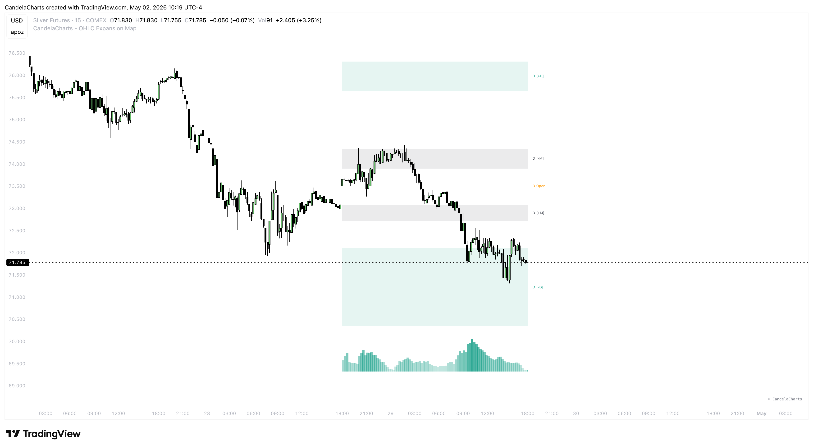

# Volatility

<figure><figcaption></figcaption></figure>

The **Volatility** component of the OHLC Expansion Map is a dynamic filter that identifies zones where price is expected to move with high velocity. It doesn't just show potential distance; it identifies the "speed lanes" of the market.

### The Volatility Box

The Volatility Box is a visual representation of momentum potential based on the Average True Range (ATR). It identifies the specific areas where institutional algorithms are likely to accelerate price delivery.

#### Understanding the Zones

* **High Velocity Zones:** When price enters the Volatility Box, it is entering a zone of high statistical expansion. In these areas, price moves fast, structure is cleaner, and displacement is strongest. This is where you want to see your trade "take off."
* **Low Velocity Zones:** Areas outside the behavioral levels and the volatility box are often characterized by choppy, random price action. These are "slow lanes" where fake-outs are common and institutional intent is not yet confirmed.

#### Practical Application

* **Momentum Confirmation:** A trade entry that occurs as price is entering the Volatility Box has a much higher probability of reaching its target quickly.
* **Expansion Velocity:** Use the box to gauge the "strength" of an AMD cycle. If price sweeps a Manipulation (±M) zone and then enters the Volatility Box with speed, it confirms the Distribution phase is in full effect.
* **Profit Velocity:** If you are in a trade and price is moving through the Volatility Box, it is a signal to hold for the full target (±D), as the "momentum fuel" is at its peak.

### Settings

* **Show Box:** Toggle the momentum zones on your chart.
* **Gap Multiplier:** Controls the distance from the open/behavioral levels to the start of the high-velocity zone.
* **Height Multiplier:** Controls the vertical depth of the volatility lane.
* **Color:** Customize the box color to match your momentum-trading visual preferences.

### The Role of Timing

Volatility and Timing are inextricably linked. High-velocity moves typically occur during **Killzones** and **Macros**. A Volatility Box entry during a London Macro is the highest-conviction setup in the expansion map.
