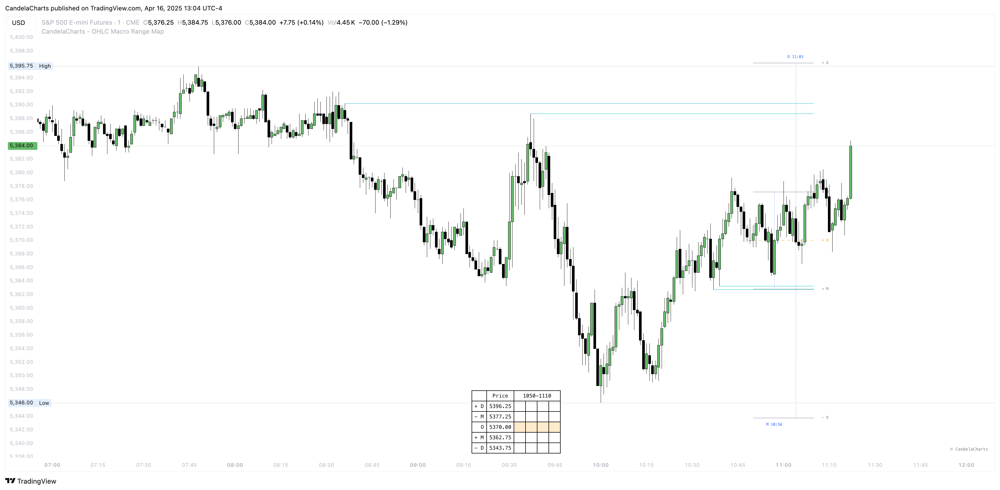

# Liquidity

<figure><figcaption></figcaption></figure>

**The OHLC Macro Range Map features an advanced liquidity detection system designed to identify and highlight key liquidity levels within Manipulation and Distribution zones.**&#x20;

These zones typically represent areas of concentrated market interest, where institutional orders are likely to accumulate and where significant price reactions are often observed. By visually mapping the overlap between liquidity clusters and critical market zones, the tool helps traders pinpoint areas where price is more likely to reverse or accelerate.

Traders have full control over the granularity of liquidity detection with an adjustable threshold setting, allowing them to customize the display based on their individual strategy, risk tolerance, and preferred timeframe.

In many cases, when price approaches a Manipulation or Distribution zone that coincides with a major liquidity area, it creates a high-probability reversal point. These intersections often indicate intentional actions by larger market participants—such as stop hunts or liquidity sweeps—followed by sharp directional movements.

By recognizing these confluences, traders gain a strategic edge, enabling more precise entries, better risk management, and alignment with institutional market flows.
