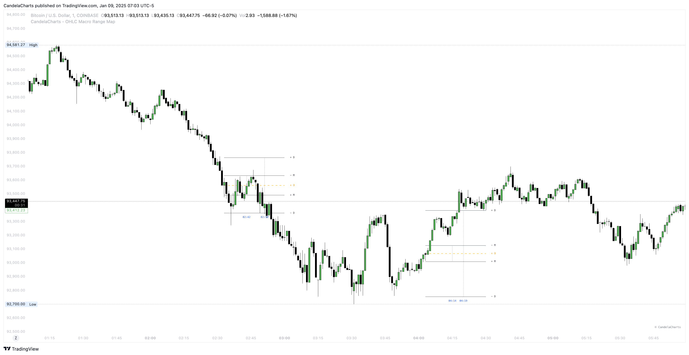
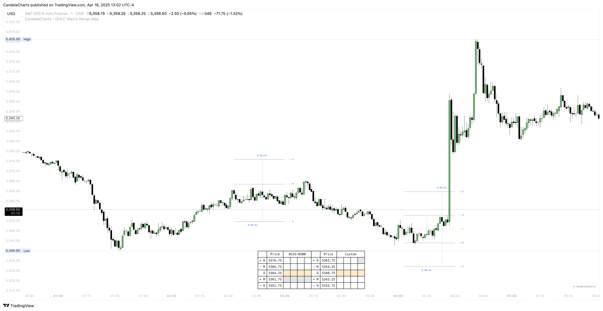

# Liquidity

The **OHLC Macro Range Map** incorporates an advanced liquidity detection system that identifies and highlights areas of concentrated market interest. These zones mark regions where buy and sell orders commonly accumulate, increasing the probability of price reactions—especially when they coincide with key Manipulation and Distribution levels.

<figure><figcaption></figcaption></figure>

By clearly visualizing the confluence between liquidity pools and manipulation or distribution zones, the tool enables traders to anticipate potential reversals and critical market turning points. Liquidity sensitivity is fully customizable through an adjustable threshold, allowing traders to tailor the level of detail to suit their preferred strategy and timeframe.

When price enters a Manipulation or Distribution level that overlaps with a liquidity zone, it often signals a high-probability reversal area. These confluences frequently reflect intentional activity by larger market participants, such as liquidity sweeps or stop hunts, followed by strong directional moves. Recognizing these conditions can greatly improve entry accuracy, trade confirmation, and risk management.

The **OHLC Macro Range Map** classifies liquidity into two categories:

* **Liquidity Levels:** Active zones where liquidity remains intact and price reactions are likely.

<figure><figcaption></figcaption></figure>

* **Invalidated Liquidity Levels:** Areas where liquidity has already been consumed or cleared.

<figure><figcaption></figcaption></figure>

Traders have the option to show or hide invalidated liquidity levels, enabling a focused view on untouched liquidity while still preserving access to historical liquidity data for deeper market analysis.
