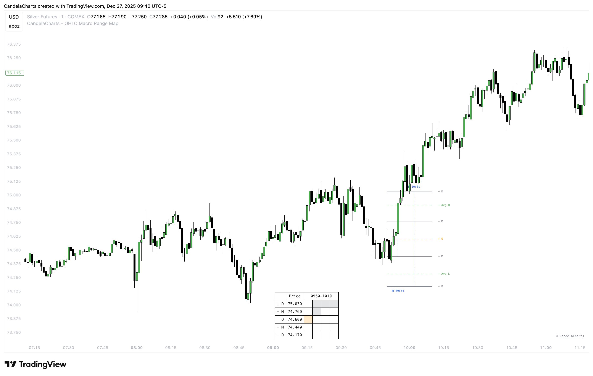
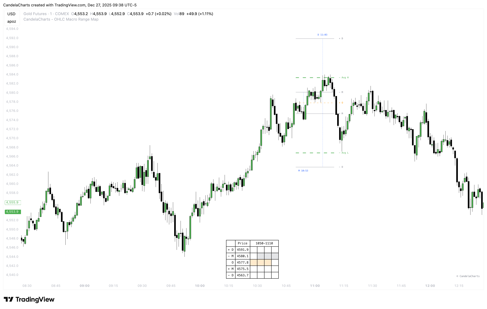

# Statistical Levels

The **OHLC Macro Range Map** is a dynamic tool that enhances candlestick analysis by mapping statistical levels based on the Open, High, Low, and Close values of each candle.

<figure><figcaption></figcaption></figure>

It provides a comprehensive understanding of market behavior by identifying key phases of price action, particularly manipulation and distribution.

These phases are critical for traders aiming to spot potential reversals, trends, and liquidity draws within the market.

### **Statistical Manipulation Levels**

Manipulation occurs when the price is intentionally driven in a direction that misleads traders, often through large wicks or rapid moves.

<figure><figcaption></figcaption></figure>

By analyzing the range between the Open and the Low for bullish candles, or between the Open and the High for bearish candles, the **OHLC Macro Range Map** identifies these deceptive moves.

Manipulation levels are often seen as false signals intended to lure traders into taking positions in the "wrong" direction. Recognizing these manipulation levels helps traders avoid being misled by price moves and instead anticipate possible reversals.

### **Statistical Distribution Levels**

Distribution, on the other hand, represents the true movement of price after manipulation, typically extending further in the direction of the market’s trend.

<figure><figcaption></figcaption></figure>

For bullish candles, distribution occurs when the price moves from Open to High, while for bearish candles, it extends from Open to Low.

These distribution levels reflect genuine price action and provide valuable clues for identifying liquidity targets, retracement zones, or potential reversals.

The **OHLC Macro Range Map** enables traders to track these distribution phases and adjust their strategies accordingly, whether they are seeking breakout opportunities or anticipating reversals based on key price levels.

### **Statistical High/Low Levels**

High/Low Levels are derived by applying statistical averaging methods—most commonly the mean or median—to a defined set of historical price highs and lows over a selected lookback period.&#x20;

<figure><figcaption></figcaption></figure>

This approach smooths out short-term volatility and minimizes market noise, allowing clearer identification of price areas where the market has previously found balance.

Once calculated, these averaged highs and lows are plotted on the chart as horizontal reference levels within the **OHLC Macro Range Map**. Traders use them as potential support and resistance zones, where price is more likely to pause, react, or reverse due to prior market behavior and clustered order activity.&#x20;

Because these levels are based on aggregated historical data rather than single price extremes, they generally provide more reliable and structurally significant reaction zones than isolated highs or lows.

***

By continuously analyzing manipulation and distribution levels over varying time periods, the **OHLC Macro Range Map** offers deeper insights into market structure, enhancing traders' ability to make informed, data-driven decisions.

Understanding where manipulation and distribution occur within each candlestick improves the trader’s ability to identify opportunities and manage risk effectively.
