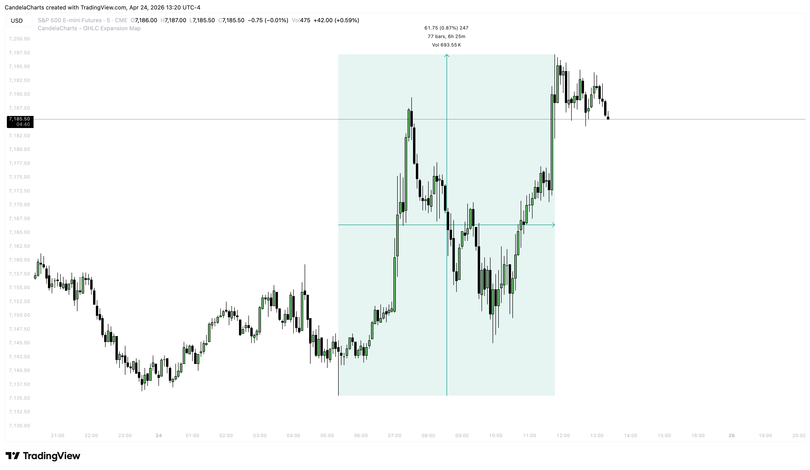

# Calculation

The **OHLC Range Map** is a sophisticated tool designed to provide deeper insights into market dynamics by analyzing candlestick data using two core statistical methods:

* **Mean**
* **Median**
* **Both**

These methods, coupled with insights into manipulation and distribution phases, empower traders to make more informed decisions based on price action.

### **1. Mean vs. Median**

When building a statistical picture of market behavior — say, tracking daily point ranges on NQ — mean and median tell you different things.&#x20;

<figure><figcaption></figcaption></figure>

Knowing which to trust in a given context is what separates clean analysis from misleading data.

#### **1.1. Mean — The Overall Average**&#x20;

Add all values, divide by the count:

* Values: 132, 197, 198, 210, 350
* Sum = 1087
* Mean = 1087 / 5 = **217.4**

Simple enough — but the problem is sensitivity. That 350-point session, likely driven by a high-impact catalyst like NFP, FOMC, or CPI, pulls the average up and makes the "typical" day look bigger than it actually is.

#### **1.2. Median — The True Middle**&#x20;

Sort the same values and take the center figure:

* Sorted Values: 132, 197, **198**, 210, 350
* Median = **198**

No weighting, no distortion. The outlier exists in the data set, but it no longer dominates the result. What you're left with is a number that better represents what a normal session actually looks like.

When studying market movements, traders often look at price ranges to gauge trends and volatility. These ranges can be expressed either in points or percentages, and each approach offers a different perspective on how the market behaves over time. Here’s a clearer look at how they differ and why it matters.

### **2. Points vs. Percentage**

When studying market movements, traders often look at price ranges to gauge trends and volatility. These ranges can be expressed either in points or percentages, and each approach offers a different perspective on how the market behaves over time.&#x20;

<figure><figcaption></figcaption></figure>

Here’s a clearer look at how they differ and why it matters.

#### **2.1. Understanding Price Measurements**

TradingView’s _Price Range_ tool highlights three main values:

* **Points**: The raw difference in price between two selected points on a chart. For example, a move of 1,770 points reflects the absolute change.
* **Percentage**: The relative change based on the starting price. In this case, that same move equals an 8.56% increase.
* **Ticks**: The number of smallest price increments between the two points. Here, that totals 7,080 ticks, though this varies by market and timeframe.

#### **2.2. How a 1,000-Point Move Changes Over Time**

A fixed point move doesn’t carry the same weight as markets evolve:

* **2010**: A 1,000-point move took more than a year and represented a 32% increase.
* **2019**: The same move happened in about a month, equating to an 11% gain.
* **2024**: It occurred in just three days, with only a 5% impact.

These comparisons show that while the number of points stays the same, its significance shrinks as overall price levels rise. In other words, markets expand, and identical point moves become less meaningful in percentage terms.

#### **2.3. Choosing Between Points and Percent**

StatMap allows traders to switch between measuring in points or percentages, depending on their needs:

* **Percent**: Ideal for assets that have grown substantially over time, like indices or cryptocurrencies. It provides a better sense of relative movement, especially when analyzing long-term data using features like Maximum Lookback.
* **Points**: More suitable for markets with relatively stable price ranges, such as forex pairs. It can also be useful for short-term volatility analysis with smaller lookback periods.
