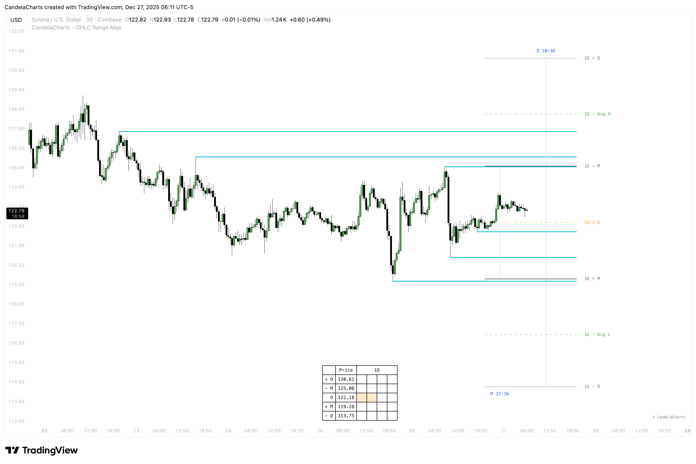
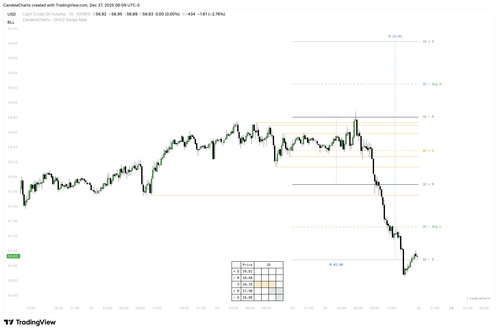

# Liquidity

<figure><figcaption></figcaption></figure>

The **OHLC Range Map** includes an advanced liquidity detection system that identifies and highlights areas of significant market interest. These zones reflect where buy and sell orders tend to accumulate and where price is more likely to react, especially when they align with key **Manipulation** and **Distribution** levels.

By visually mapping the overlap between liquidity clusters and manipulation or distribution zones, the tool helps traders anticipate potential **market reversals and turning points**. The sensitivity of liquidity detection can be adjusted through a customizable **threshold setting**, allowing users to control the level of detail based on their trading strategy and selected timeframe.

When price approaches a Manipulation or Distribution level that coincides with a liquidity zone, it often represents a **high-probability reversal area**. These confluences frequently signal engineered moves by larger market participants—such as **stop runs or liquidity grabs**—followed by strong directional reactions. Recognizing these conditions can give traders a valuable edge in **entry timing, trade confirmation, and risk management**.

The OHLC Range Map distinguishes between two types of liquidity levels:

* **Liquidity Levels** – Active zones where liquidity remains available and price is likely to respond.

<figure><figcaption></figcaption></figure>

* **Invalidated Liquidity Levels** – Zones where liquidity has already been consumed or taken out.

<figure><figcaption></figcaption></figure>

Users can toggle invalidated liquidity levels on or off, making it easy to focus on **untapped liquidity** while still retaining the ability to review historical liquidity events for added market context.
