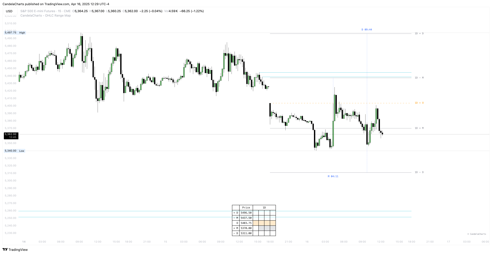

# Liquidity

<figure><figcaption></figcaption></figure>

**The OHLC Range Map features an advanced liquidity detection tool that highlights liquidity levels aligned with key Manipulation and Distribution zones.**

These levels often represent areas of heightened market interest, where orders tend to accumulate and price is likely to react. By visually mapping where liquidity clusters overlap with manipulation or distribution zones, the tool helps traders anticipate potential turning points in the market.

Users can fine-tune the **granularity of liquidity detection** by adjusting the **threshold setting**, allowing for greater precision in identifying relevant levels based on their strategy and timeframe.

In many cases, when price approaches a Manipulation or Distribution level that coincides with a liquidity zone, it marks a **high-probability reversal area**.&#x20;

These confluences often indicate engineered moves by larger market participants—such as stop runs or liquidity grabs—followed by sharp directional reversals. Recognizing these setups can offer traders a significant edge in timing entries and managing risk.
