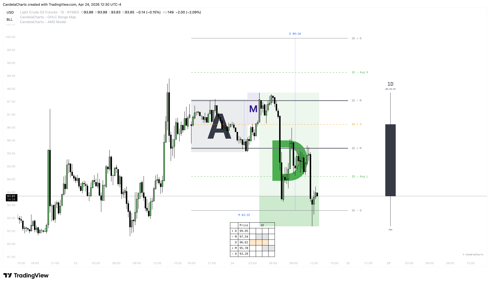

# OHLC & OLHC

### **OHLC/OLHC – The Building Blocks of Price Action**

Understanding how price behaves during a trading session is essential for making better decisions. One of the most effective ways to visualize this movement is through the OHLC (Open, High, Low, Close) chart—sometimes referred to as OLHC.&#x20;

<figure><figcaption></figcaption></figure>

Whether you’re just starting out or refining your approach, mastering OHLC can greatly improve how you read market behavior.

### **What is OHLC?**

OHLC represents four key price points within a trading session:

1. **Open** – The price at which the market begins trading at the start of the session
2. **High** – The highest price reached during the session
3. **Low** – The lowest price reached during the session
4. **Close** – The price at which the session ends

These values are displayed on candlestick charts. The open and close form the body of the candle, while the high and low appear as wicks (or shadows) extending above and below.

### **Why OHLC/OLHC is Important**

The OHLC structure provides a detailed view of price movement and highlights key market dynamics:

* **Volatility**: The range between the high and low shows how much price moved during the session. Long wicks often signal indecision or rejection at certain levels, which can hint at potential reversals or continuations.
* **Market Sentiment**: Comparing the open and close reveals whether the session was bullish or bearish. A series of candles moving in the same direction often indicates a strong trend.
* **Order Blocks**: OHLC candles can help identify potential order block zones. The opening price, in particular, is often a sensitive level—especially in candles with large bodies.

### **Enhancing OHLC with Statistical Mapping**

While OHLC offers a solid foundation, combining it with Statistical Mapping can provide deeper insight. This approach highlights average price zones where manipulation and distribution tend to occur, helping you align these levels with real-time price action.

<figure><figcaption></figcaption></figure>

For instance, OHLC shows you where price opened, closed, and reached its extremes, but Statistical Mapping helps identify where these turning points are most likely to happen based on historical behavior. This added layer can help you anticipate reversals or recognize when a trend is likely to continue.
