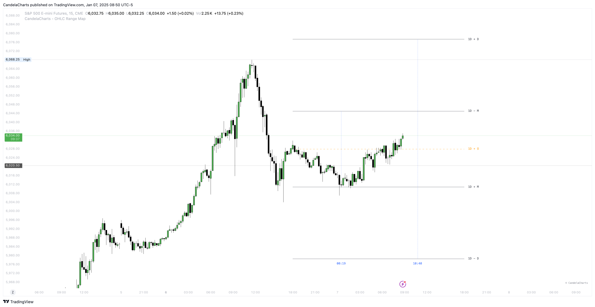

# Overview

<figure><figcaption></figcaption></figure>

Enhance your TradingView toolkit by incorporating this powerful indicator into your trading strategies for actionable insights.


[timeframes.md](timeframes.md)



[po3.md](po3.md)



[algorithm.md](algorithm.md)



[liquidity.md](liquidity.md)



[statistical-levels.md](statistical-levels.md)



[panel.md](panel.md)



[alerts.md](alerts.md)


Going beyond traditional OHLC visuals, this advanced tool applies Inner Circle Trader (ICT) principles to analyze accumulation, manipulation, and distribution on a candle-by-candle basis.
