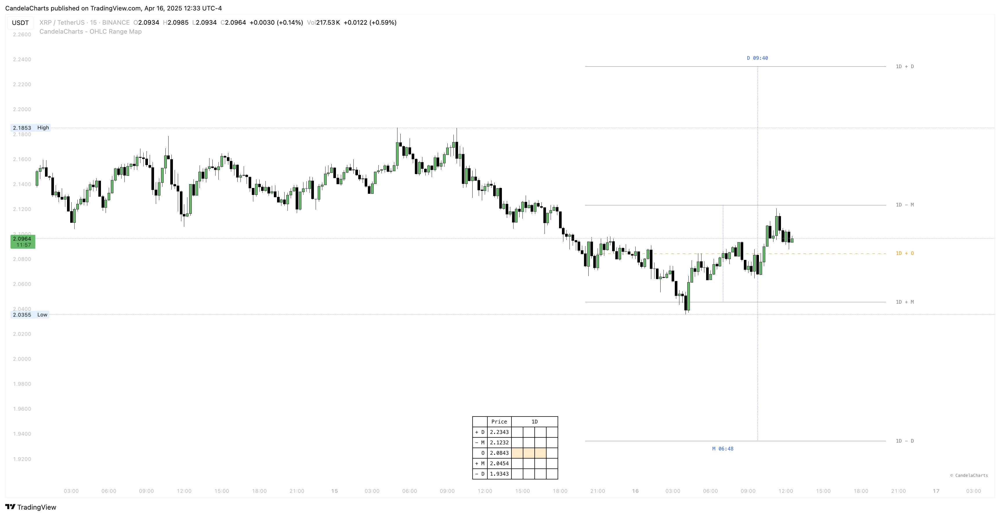

# Panel

<figure><figcaption></figcaption></figure>

**The OHLC Range Map Panel offers a dynamic visual representation of price behavior, drawing its movement in real time based on key Manipulation and Distribution levels.**

The flowing, continuous motion of the display resembles the path of a "snake game," visually tracing how price interacts with significant market zones.&#x20;

This intuitive design helps traders better understand the rhythm and structure of market activity as it unfolds, highlighting areas where price is likely being influenced by smart money tactics such as liquidity grabs or engineered reversals.

By visually mapping price action in this fluid format, the panel provides a unique and engaging way to track market structure, enhancing situational awareness and pattern recognition.
