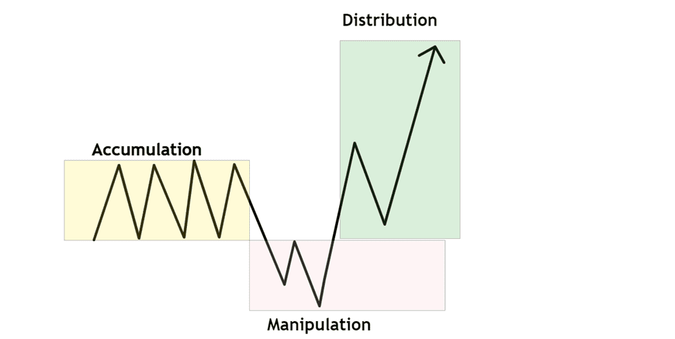

# PO3

<figure><figcaption></figcaption></figure>

The ICT Power of Three (PO3/AMD) is a trading strategy developed by Michael Huddleston, also known as "The Inner Circle Trader" (ICT). It aims to help traders identify and capitalize on market movements driven by institutional investors, often referred to as "smart money." The strategy is structured around three distinct phases: Accumulation, Manipulation, and Distribution.

### **1. Accumulation Phase**

In this initial phase, smart money quietly builds positions within a narrow price range, often during low-volatility periods such as the Asian trading session. This consolidation creates liquidity on both sides of the market, setting the stage for future price movements.

### **2. Manipulation Phase**

Following accumulation, prices are deliberately moved to trigger retail traders' stop-loss orders, creating false breakouts. This manipulation misleads traders into entering positions that are later reversed, allowing smart money to accumulate more favorable positions.

### **3. Distribution Phase**

In the final phase, smart money drives the market in the intended direction, capitalizing on the liquidity created during the manipulation phase. This phase often results in strong price movements that align with the initial accumulation, leading to significant profits for those who correctly identify the preceding phases.

The PO3 strategy is typically applied on shorter timeframes, such as 5 to 15 minutes, to capture intraday price movements. By understanding and identifying these phases, traders can align their positions with institutional activities, potentially improving their trading outcomes.
