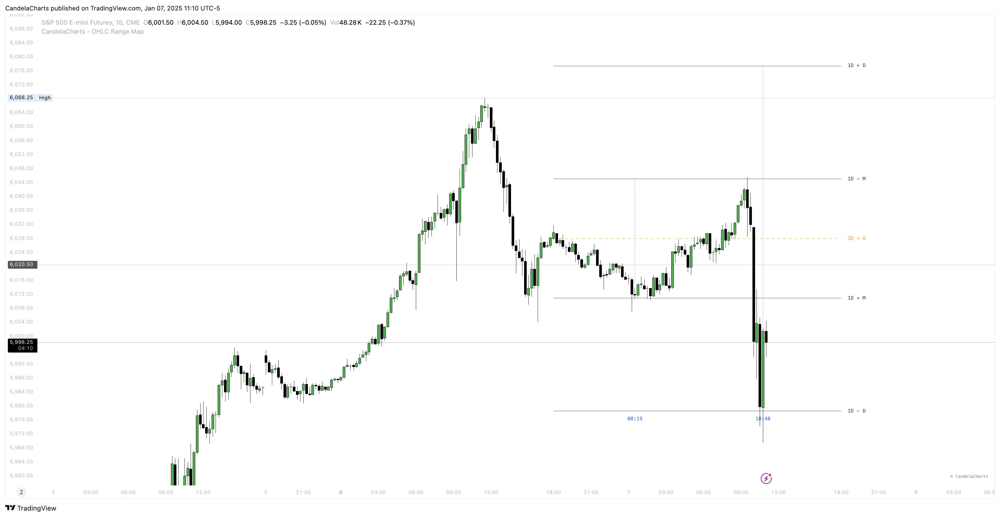

# Statistics

The **OHLC Range Map** is a dynamic tool that enhances candlestick analysis by mapping statistical levels based on the Open, High, Low, and Close values of each candle.&#x20;

It provides a comprehensive understanding of market behavior by identifying key phases of price action, particularly **manipulation** and **distribution**.&#x20;

<figure><figcaption></figcaption></figure>

These phases are critical for traders looking to spot potential reversals, trends, and liquidity draws in the market.

### **Statistical Manipulation Levels**

**Manipulation** occurs when price is intentionally driven in a direction that misleads traders, often through large wicks or rapid moves.&#x20;

By analyzing the range between the **Open** and the **Low** for bullish candles or between the **Open** and the **High** for bearish candles, the OHLC Range Map identifies these deceptive moves.&#x20;

Manipulation levels are often seen as false signals intended to entice traders into taking positions in the "wrong" direction. Recognizing these manipulation levels helps traders avoid getting caught in misleading price moves and instead anticipate possible reversals.

### **Statistical Distribution Levels**

**Distribution**, on the other hand, represents the true movement of price after manipulation, typically extending further in the direction of the market’s trend.&#x20;

For bullish candles, distribution occurs when the price moves from **Open** to **High**, while for bearish candles, it extends from **Open** to **Low**. These distribution levels represent genuine price action and offer key clues for identifying liquidity targets, retracement zones, or potential reversals.&#x20;

The OHLC Range Map allows traders to track these distribution phases and adjust their strategies accordingly, whether they are looking for breakout opportunities or potential reversals based on key price levels.

By continuously analyzing these manipulation and distribution levels over varying time periods, the OHLC Range Map allows traders to gain deeper insights into market structure, increasing their ability to make informed, data-driven decisions.&#x20;

Understanding where manipulation and distribution occur on each candlestick enhances the trader’s ability to spot opportunities and manage risk more effectively.
