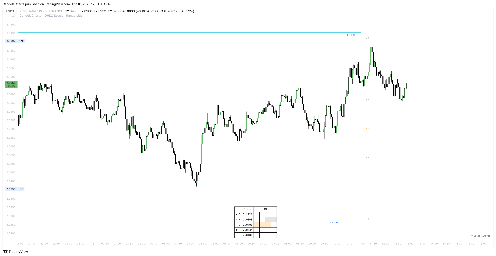

# Liquidity

<figure><figcaption></figcaption></figure>

**The OHLC Session Range Map is equipped with a sophisticated liquidity detection system that identifies and highlights key liquidity levels aligned with Manipulation and Distribution zones.**

These zones often mark areas of concentrated market interest—where institutional orders are likely to accumulate and where price reactions are frequently observed. By visually illustrating the overlap between liquidity clusters and high-impact market zones, the tool helps traders pinpoint areas where price is most likely to reverse or accelerate.

**Users have full control over the granularity of liquidity detection** through an adjustable **threshold setting**, enabling them to tailor the display according to their specific strategy, risk appetite, and preferred timeframe.

In many instances, when price approaches a Manipulation or Distribution level that coincides with a notable liquidity zone, it forms a **high-probability reversal point**. These intersections often signal deliberate actions by larger market participants—such as stop hunts or liquidity sweeps—followed by swift directional moves.

**Recognizing these confluences provides traders with a strategic advantage**, allowing for more precise entries, improved risk management, and alignment with the flow of institutional activity.
