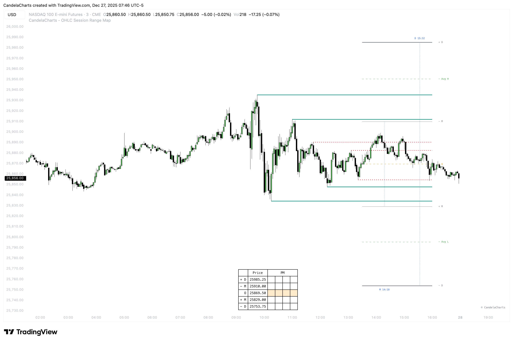
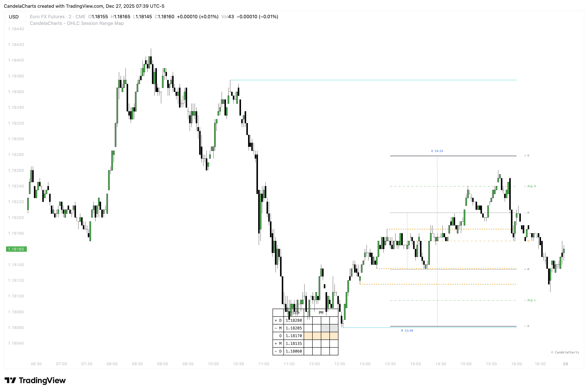

# Liquidity

The **OHLC Session Range Map** features a sophisticated liquidity detection system designed to pinpoint and highlight areas of strong market interest. These zones represent regions where buy and sell orders tend to cluster, increasing the likelihood of price reactions—particularly when they align with key Manipulation and Distribution levels.

<figure><figcaption></figcaption></figure>

By visually displaying the confluence between liquidity pools and manipulation or distribution zones, the tool helps traders anticipate potential reversals and market turning points. Liquidity sensitivity is fully adjustable through a customizable threshold, enabling traders to fine-tune the level of detail to match their strategy and timeframe.

When price moves into a Manipulation or Distribution level that overlaps with a liquidity zone, it often marks a high-probability reversal area. Such confluences frequently indicate deliberate actions by larger market participants, including stop hunts or liquidity sweeps, followed by strong directional moves. Identifying these setups can significantly enhance entry precision, trade validation, and risk control.

The **OHLC Session Range Map** categorizes liquidity into two distinct types:

* **Liquidity Levels** – Active zones where liquidity remains present and price is likely to react.

<figure><figcaption></figcaption></figure>

* **Invalidated Liquidity Levels** – Areas where liquidity has already been absorbed or cleared.

<figure><figcaption></figcaption></figure>

Traders can choose to display or hide invalidated liquidity levels, allowing them to focus on untouched liquidity while still accessing historical liquidity information for deeper market insight.
