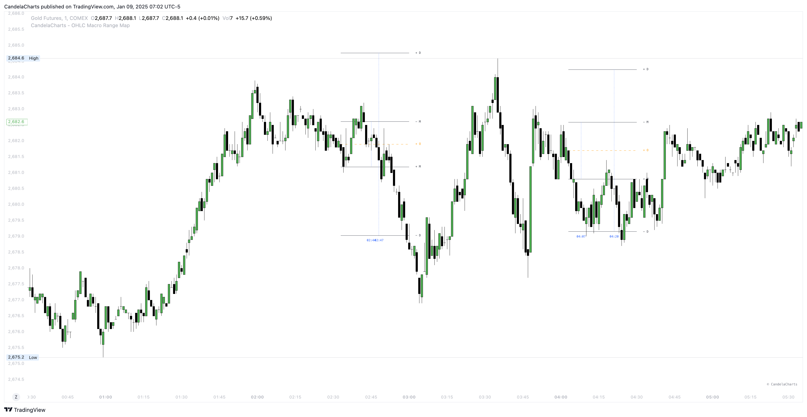

# Overview

<figure><figcaption></figcaption></figure>

Elevate your TradingView toolkit with the **OHLC Session Range Map**—an advanced indicator crafted to deliver actionable insights for more refined trading strategies.


[sessions.md](sessions.md)



[po3.md](po3.md)



[calculation.md](calculation.md)



[liquidity.md](liquidity.md)



[statistics.md](statistics.md)



[panel.md](panel.md)



[alerts.md](alerts.md)


Going beyond traditional OHLC visualizations, this powerful tool leverages Inner Circle Trader (ICT) principles to analyze accumulation, manipulation, and distribution dynamics. It offers a detailed, candle-by-candle breakdown, enabling a deeper understanding of market behavior.
