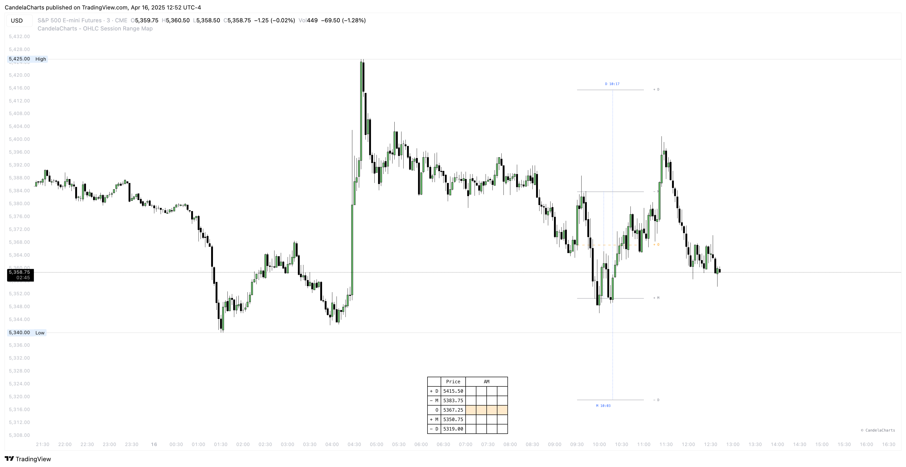

# Panel

<figure><figcaption></figcaption></figure>

**The OHLC Session Range Map Panel delivers a dynamic and intuitive visualization of price behavior, rendering market movement in real time based on key Manipulation and Distribution levels.**

The panel’s continuous, flowing display—reminiscent of the motion in a classic "snake game"—traces the path of price as it interacts with critical market zones. This real-time visualization reveals how price behaves around areas of institutional interest, such as liquidity pools and engineered reversals.

By capturing the rhythm and structure of price action in a fluid, easy-to-follow format, the panel helps traders develop a deeper understanding of market dynamics. It highlights moments where "smart money" tactics may be in play, allowing users to spot potential setups with greater confidence.

**This visual approach not only enhances situational awareness, but also strengthens pattern recognition—empowering traders to interpret market structure with precision and clarity.**
