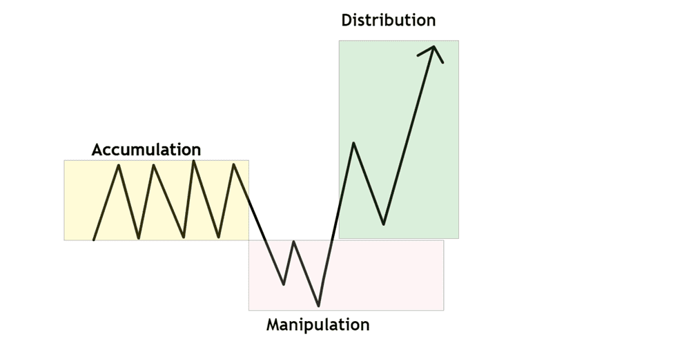

# PO3

<figure><figcaption></figcaption></figure>

**The ICT Power of Three (PO3/AMD)** is a strategic market framework introduced by Michael Huddleston, widely known as _The Inner Circle Trader (ICT)_. Designed to help traders better understand institutional trading behavior—often referred to as "smart money"—this approach focuses on identifying the three core phases that typically drive price movement: **Accumulation, Manipulation, and Distribution**.

### 1. Accumulation Phase

This phase marks the beginning of the cycle, where institutional players—smart money—gradually build their positions within a tight, low-volatility price range. This often occurs during quieter sessions, such as the **Asian trading session**, where price moves sideways and consolidates. Liquidity builds up above and below this range in the form of retail stop-losses and pending orders, setting a trap for less-informed market participants.

### 2. Manipulation Phase

Once sufficient liquidity has formed, smart money initiates sharp price movements that are designed to trigger retail stop-losses or entice traders into false breakouts. This is the **manipulation** stage, where the market is intentionally driven in the _wrong_ direction to create emotional responses and poor entries from retail traders. This phase allows institutions to refine their positions at more favorable prices by taking the other side of these reactive trades.

### 3. Distribution Phase

After accumulating positions and shaking out retail participants, smart money finally moves the market in its **intended direction**. This is the **distribution** phase, characterized by strong, directional price moves that align with the initial accumulation. Here, institutions offload their positions into the liquidity generated during the manipulation phase, capturing the bulk of the move and realizing profits.
