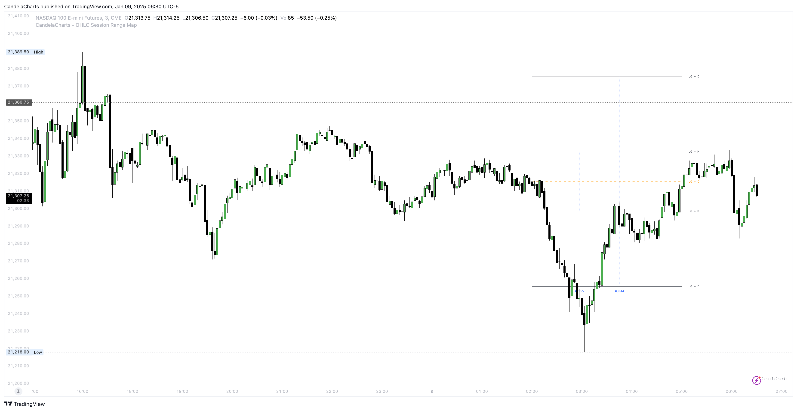

# Statistical Levels

The **OHLC Session Range Map** is a dynamic tool that enhances candlestick analysis by mapping statistical levels based on the Open, High, Low, and Close values of each candle.

It provides a comprehensive understanding of market behavior by identifying key phases of price action, particularly manipulation and distribution, specific to each trading session.

These phases are essential for traders looking to identify potential reversals, trends, and liquidity draws within the market.

### **Statistical Manipulation Levels**

<figure><figcaption></figcaption></figure>

Manipulation occurs when price is intentionally driven in a direction to mislead traders, often through large wicks or sharp moves.

By analyzing the range between the Open and the Low for bullish candles or between the Open and the High for bearish candles, the **OHLC Session Range Map** identifies these deceptive moves.

Manipulation levels are often false signals that aim to entice traders into taking positions in the "wrong" direction. Recognizing these manipulation levels helps traders avoid falling for misleading price moves and better anticipate potential reversals within the session.

### **Statistical Distribution Levels**

<figure><figcaption></figcaption></figure>

Distribution represents the true price movement that occurs after manipulation, typically extending further in the direction of the market’s trend.

For bullish candles, distribution is seen when the price moves from Open to High, while for bearish candles, it extends from Open to Low.

These distribution levels reflect genuine price action and offer valuable clues for identifying liquidity targets, retracement zones, or potential reversals.

The **OHLC Session Range Map** enables traders to track these distribution phases, adapting their strategies for breakout opportunities or anticipating reversals based on key price levels.

### **Statistical High/Low Levels**

<figure><figcaption></figcaption></figure>

High/Low Levels are calculated by applying statistical averaging techniques—typically the mean or median—to a chosen range of past price highs and lows over a specified lookback period. This process reduces the impact of short-term price noise and highlights areas where the market has historically maintained equilibrium.

After calculation, these averaged highs and lows are displayed on the chart as horizontal reference levels. Traders interpret them as potential support and resistance zones, where price may hesitate, reverse, or react due to previous market responses and concentrated order flow. Since these levels are derived from combined historical data rather than isolated price points, they tend to offer more dependable reaction areas than single highs or lows.

***

By continuously analyzing these manipulation and distribution levels across varying time periods and trading sessions, the **OHLC Session Range Map** provides deeper insights into market structure. This helps traders make more informed, data-driven decisions.

Understanding where manipulation and distribution occur within each candlestick, and across different trading sessions, enhances a trader’s ability to spot opportunities and manage risk more effectively.
