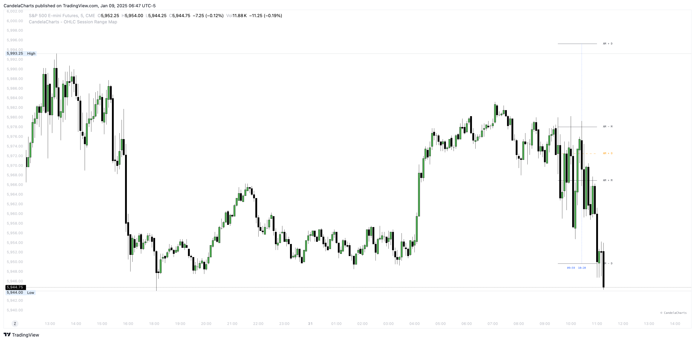

# Statistics

The **OHLC Session Range Map** is a dynamic tool that enhances candlestick analysis by mapping statistical levels based on the Open, High, Low, and Close values of each candle.&#x20;

It provides a comprehensive understanding of market behavior by identifying key phases of price action, particularly manipulation and distribution, specific to each trading session.

<figure><figcaption></figcaption></figure>

These phases are essential for traders looking to identify potential reversals, trends, and liquidity draws within the market.

### **Statistical Manipulation Levels**

Manipulation occurs when price is intentionally driven in a direction to mislead traders, often through large wicks or sharp moves.&#x20;

By analyzing the range between the Open and the Low for bullish candles or between the Open and the High for bearish candles, the **OHLC Session Range Map** identifies these deceptive moves.

Manipulation levels are often false signals that aim to entice traders into taking positions in the "wrong" direction. Recognizing these manipulation levels helps traders avoid falling for misleading price moves and better anticipate potential reversals within the session.

### **Statistical Distribution Levels**

Distribution represents the true price movement that occurs after manipulation, typically extending further in the direction of the market’s trend.&#x20;

For bullish candles, distribution is seen when the price moves from Open to High, while for bearish candles, it extends from Open to Low.&#x20;

These distribution levels reflect genuine price action and offer valuable clues for identifying liquidity targets, retracement zones, or potential reversals.

The **OHLC Session Range Map** enables traders to track these distribution phases, adapting their strategies for breakout opportunities or anticipating reversals based on key price levels.

By continuously analyzing these manipulation and distribution levels across varying time periods and trading sessions, the **OHLC Session Range Map** provides deeper insights into market structure. This helps traders make more informed, data-driven decisions.

Understanding where manipulation and distribution occur within each candlestick, and across different trading sessions, enhances a trader’s ability to spot opportunities and manage risk more effectively.
